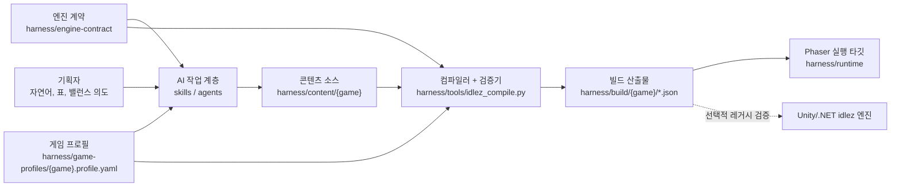
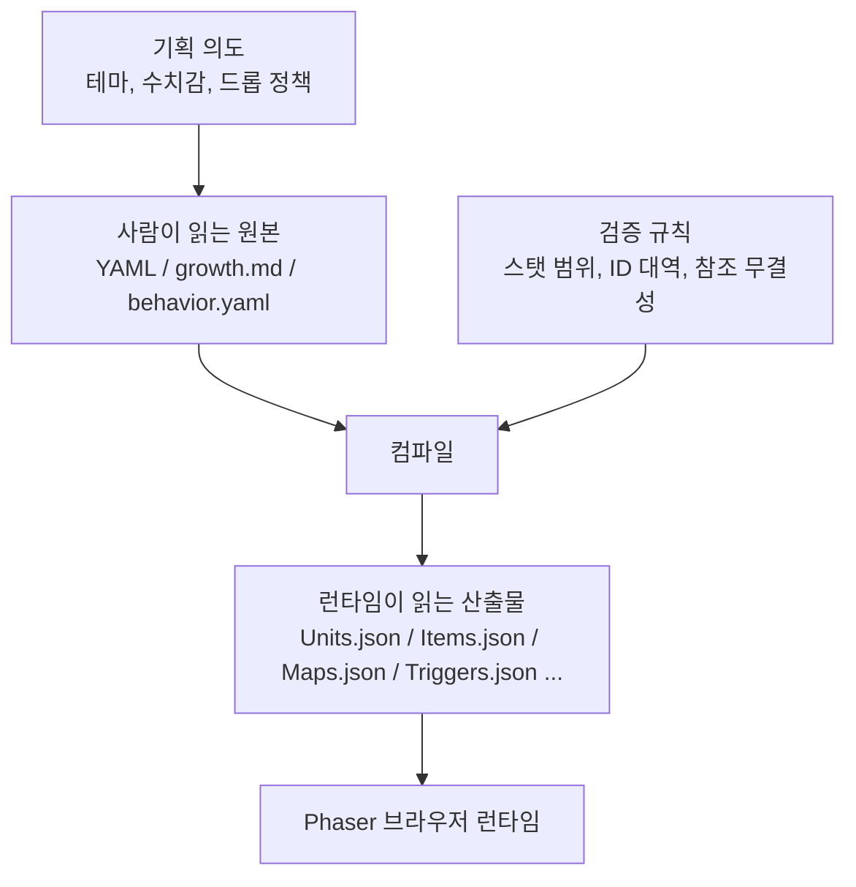
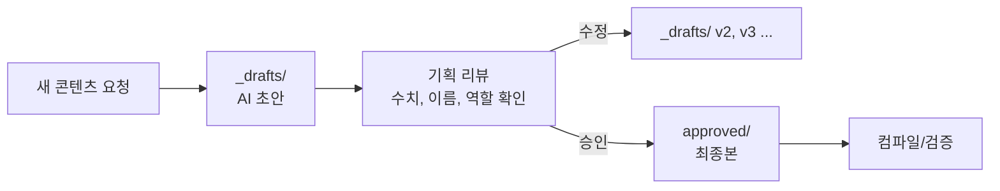
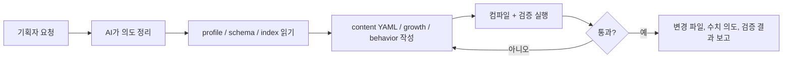
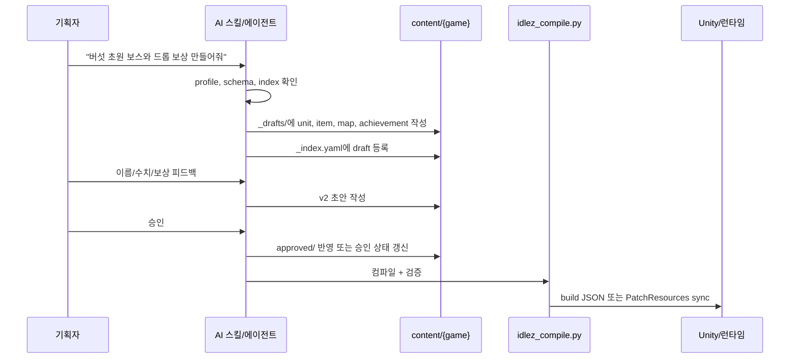
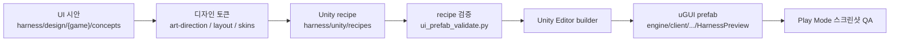
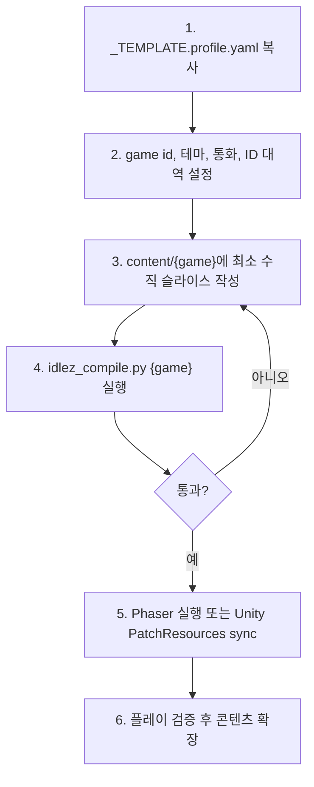

# idle-game-generator

기획자와 AI가 함께 방치형 RPG 콘텐츠를 빠르게 만들고, Phaser 브라우저 런타임에서 바로 실행하며 검증하는 제작 하네스입니다.

핵심은 단순합니다. 기획자는 자연어, 표, 수식, YAML로 콘텐츠 의도를 남기고, AI와 도구가 이를 Phaser 런타임이 읽는 JSON 번들로 컴파일합니다. 엔진 코드를 매번 고치는 방식이 아니라, `profile + content`를 갈아끼워 여러 게임을 실험하는 구조입니다.

이 공개용 lightweight 스냅샷은 Phaser 작업 경로를 중심으로 공유됩니다. Unity/.NET 기반 `idlez` 엔진은 레거시 검증 경로이며, 보통의 콘텐츠 제작자나 게임 디자이너가 작업하는 데 필요하지 않습니다.

## 한눈에 보기



이 저장소는 Phaser 제작 흐름 기준으로 크게 두 덩어리입니다.

| 영역 | 위치 | 설명 | 주 사용자 |
| --- | --- | --- | --- |
| 제작 하네스 | `harness/` | 기획 데이터, 게임 프로필, 컴파일러, 검증기, Phaser 런타임 | 기획자 + AI + 엔지니어 |
| AI 작업 계층 | `.agents/`, `.claude/` | 콘텐츠 생성/리뷰/밸런스/디자인 작업 절차 | AI 작업자 |

내부 전체 스냅샷에는 `engine/`도 존재하지만, 공개 작업자는 보통 `harness/content/`, `harness/game-profiles/`, `harness/runtime/`만 보면 됩니다.

## 왜 이런 구조인가

방치형 RPG는 유닛, 장비, 드롭, 성장 곡선, 업적, 맵이 수백에서 수천 개까지 늘어납니다. 이 데이터를 엔진 JSON으로 직접 만지면 빠르게 관리가 어려워집니다.

이 프로젝트는 원본 데이터를 사람이 읽기 쉬운 형태로 유지합니다.



따라서 원칙은 하나입니다.

**기획 원본은 `harness/content/`에 두고, 엔진 JSON은 생성물로 취급합니다.**

## 핵심 개념

### 1. Engine Contract

`harness/engine-contract/`는 모든 게임이 공유하는 엔진 계약입니다. 어떤 스탯 이름을 쓸 수 있는지, 유닛/아이템/맵/스킬은 어떤 필드를 갖는지, 행동 트리거는 어떤 명령을 허용하는지를 정의합니다.

기획 관점에서는 "엔진이 이해할 수 있는 단어 사전"에 가깝습니다. 새 게임을 만든다고 이 폴더를 먼저 고치지 않습니다. 정말 엔진 기능이 늘어날 때만 변경합니다.

### 2. Game Profile

`harness/game-profiles/<game>.profile.yaml`은 게임별 규칙입니다.

예를 들어 `mushroomer.profile.yaml`에는 아래 같은 내용이 들어갑니다.

- 게임 이름과 테마
- 사용하는 스탯 목록
- 골드, 루비, 경험치 같은 통화 ID
- 유닛/아이템/맵/업적의 ID 대역
- 성장 상한, 오프라인 보상 시간, 행동 제한

즉, `engine-contract`가 공통 문법이라면 `game-profile`은 이번 게임의 룰북입니다.

### 3. Content

`harness/content/<game>/` 아래가 실제 콘텐츠 작업 공간입니다.

| 폴더 | 내용 |
| --- | --- |
| `units/` | 플레이어, 몬스터, 보스, 펫 등 |
| `items/` | 통화, 재료, 장비, 상품, 스탯 성장 아이템 등 |
| `skills/` | 전투 스킬 정의 |
| `buffs/` | 버프/디버프 |
| `maps/` | 맵, 던전, 웨이브, 클리어 보상 |
| `achievements/` | 업적, 미션, 진행 조건, 보상 |
| `audios/` | 오디오 리소스 정의 |
| `growth/` | 레벨별 수치를 만드는 수식 문서 |
| `tutorials/` | 튜토리얼 업적/단계 매니페스트 |

### 4. Draft / Approved

대량 콘텐츠는 보통 `_index.yaml`, `_drafts/`, `approved/` 구조로 관리합니다.



중요한 운영 규칙:

- AI는 기본적으로 `_drafts/`에 초안을 만듭니다.
- 기획자가 승인한 뒤 `approved/`로 올립니다.
- `_index.yaml`은 목록, 상태, 참조 관계를 빠르게 보는 카탈로그입니다.
- 현재 컴파일러는 `_index.yaml`에 등록된 항목을 읽습니다. 릴리즈 전에는 `status`와 포함 대상을 반드시 점검해야 합니다.

## 저장소 구조

```text
idle-game-generator/
├── harness/
│   ├── engine-contract/         # 공통 스키마, 스탯, 행동 어휘
│   ├── game-profiles/           # 게임별 룰북
│   ├── content/<game>/          # 기획 원본 데이터
│   ├── design/<game>/           # UI 시안, 디자인 토큰, 컴포넌트 스킨
│   ├── unity/recipes/           # 선택적 Unity uGUI prefab 생성 레시피
│   ├── tools/                   # 컴파일러, 검증기, 보조 도구
│   ├── runtime/                 # Phaser 기반 브라우저 실행 타깃
│   └── build/<game>/            # 컴파일 산출물(gitignored)
├── .agents/skills/              # Codex/agent용 작업 스킬
├── .claude/agents/              # Claude 호환 에이전트 정의
├── .claude/skills/              # Claude 호환 스킬 정의
├── AGENTS.md                    # Codex 작업 진입점
├── CLAUDE.md                    # Claude 작업 진입점
└── README.md
```

## 빠른 시작

### 먼저 기억할 것: 기획자는 터미널을 직접 다루지 않아도 됩니다

이 문서에는 Python과 Phaser 실행 명령이 나오지만, 기획자가 매번 직접 실행하라는 뜻은 아닙니다. 실제 운영에서는 기획자가 AI에게 목표를 말하고, AI가 필요한 파일 확인, 콘텐츠 작성, 컴파일, Phaser 검증, 결과 요약을 수행합니다.

기획자 입장에서 가장 중요한 입력은 "무엇을 만들고 싶은지"입니다.

```text
mushroomer에 초반 10분용 버섯 초원 챕터를 만들어줘.
일반 몬스터 6종, 보스 1종, 장비 6종, 클리어 업적 5개가 필요해.
컴파일 검증까지 돌리고 문제가 있으면 수정해서 결과를 요약해줘.
```

AI가 내부적으로 수행하는 일은 아래와 같습니다.



따라서 아래 명령어들은 주로 AI나 엔지니어가 확인용으로 실행하는 내부 절차입니다. 기획자는 필요할 때 "컴파일 검증까지 해줘", "Phaser로 실행 확인해줘"처럼 요청하면 됩니다.

### 1. 콘텐츠 컴파일

저장소 루트에서 실행합니다.

```bash
python3 harness/tools/idlez_compile.py idlez
```

성공하면 `harness/build/idlez/`에 아래 JSON들이 생성됩니다.

```text
Units.json
Items.json
Skills.json
Buffs.json
Maps.json
Strings.json
Achievements.json
Audios.json
Triggers.json
ResourceGlobals.json
```

`mushroomer` 검증 게임도 같은 방식으로 컴파일합니다.

```bash
python3 harness/tools/idlez_compile.py mushroomer
```

현재 확인 결과(2026-06-01 기준):

| 게임 | 컴파일 결과 |
| --- | --- |
| `idlez` | 3 units, 20 items, 1 map, 20 achievements, 9 triggers, 통과 |
| `mushroomer` | 3 units, 79 items, 15 maps, 31 achievements, 12 triggers, 통과 |

### 2. Phaser로 검증 게임 실행하기

Phaser 런타임은 단순 미리보기가 아니라 실제 게임 실행 타깃입니다. Unity 없이도 콘텐츠 JSON을 읽어 전투, 성장, 보상 루프를 실행할 수 있고, 일부 게임은 Phaser 기반으로 제작될 수 있습니다.

기획자는 보통 이렇게 요청합니다.

```text
mushroomer 검증 게임을 Phaser로 실행해줘.
콘텐츠 컴파일을 먼저 돌리고, 브라우저에서 실행한 뒤 화면/콘솔 에러와 기본 전투 루프를 확인해서 요약해줘.
```

AI/엔지니어가 수행하는 기본 절차:

```bash
python3 harness/tools/idlez_compile.py mushroomer
python3 -m http.server 8765
```

그 다음 브라우저에서 엽니다.

```text
http://127.0.0.1:8765/harness/runtime/idlez-phaser.html
```

반복 확인은 전용 smoke 하네스로 실행할 수 있습니다.

```bash
python3 harness/tools/phaser_smoke.py mushroomer --no-browser
python3 harness/tools/phaser_smoke.py mushroomer --screenshot /private/tmp/idlez-phaser-smoke.png
```

`--no-browser`는 컴파일과 로컬 HTTP 연결만 확인합니다. 브라우저 smoke는 headless Chrome을 띄워 Phaser context, canvas, board tick 진행을 확인합니다. 세부 분리는 [harness/runtime/PHASER_HARNESS.md](harness/runtime/PHASER_HARNESS.md)에 정리되어 있습니다.

현재 `idlez-phaser.html`은 `mushroomer` 중심으로 연결되어 있습니다. 이 경로는 검증 게임을 가장 빠르게 실행하는 기본 루트입니다.

확인할 것:

- 화면이 정상적으로 뜨는가
- 플레이어/몬스터/맵/HUD가 표시되는가
- 자동 전투와 웨이브 진행이 동작하는가
- 골드, 성장 버튼, 보상 흐름이 수치적으로 어색하지 않은가
- 브라우저 콘솔에 리소스 로드 실패나 런타임 에러가 없는가

### 3. 선택: Unity로 추가 검증하기

Unity 검증은 내부 전체 스냅샷에서 엔진 연동, `PatchResources`, Addressables/프리팹, 서버 연결까지 확인할 때 사용합니다. 공개용 lightweight 스냅샷에는 `engine/`과 `harness/examples/patchresources/`가 포함되지 않을 수 있으며, Phaser 작업만 하는 사람에게는 필요하지 않습니다.

기획자는 보통 이렇게 요청합니다.

```text
mushroomer를 Unity에서도 실행 검증해줘.
Phaser 검증이 통과한 뒤 PatchResources sync, 로컬 서버 상태 확인, Unity Play 진입까지 확인하고 막히는 지점을 요약해줘.
```

AI/엔지니어가 수행하는 기본 절차:

컴파일은 `harness/build/<game>/`까지만 만듭니다. 실제 Unity 클라이언트 리소스 폴더에 넣으려면 sync 도구를 명시적으로 실행합니다.

```bash
python3 harness/tools/idlez_compile.py mushroomer
python3 harness/tools/sync_patchresources_seed.py mushroomer
```

이 명령은 다음을 `engine/client/Client/Assets/PatchResources/`로 복사합니다.

- 컴파일된 JSON 번들
- 부팅에 필요한 기본 파일
- `harness/examples/patchresources/`에서 가져온 seed 에셋
- 컴파일된 콘텐츠가 참조하는 Unity 에셋 의존성 일부

실제 Unity 리소스 폴더를 변경하는 명령이므로, 실행 전에는 작업 중인 변경사항을 확인하는 편이 좋습니다.

주의: `harness/examples/patchresources/`는 참고/seed용입니다. 직접 진실 원본으로 삼지 말고, 콘텐츠 원본은 계속 `harness/content/<game>/`에서 관리합니다.

### 4. 선택: Unity용 로컬 서버 실행

Unity 클라이언트를 로컬 서버에 붙여 확인할 때 사용합니다.

```bash
cd engine/server
docker compose -f docker-compose.local.yml up -d --build
```

기본 접속점:

| 항목 | 주소 |
| --- | --- |
| Postgres | `localhost:15432` |
| WorldServer | `localhost:11177` |
| ApiServer | `http://localhost:15000` |
| Swagger | `http://localhost:15000/swagger` |

Unity 에디터는 `engine/client/Client/Assets/Resources/Debug.xml` 설정을 통해 기본적으로 위 로컬 서버를 바라봅니다.

## 검증 게임 실행 예시: mushroomer

`mushroomer`는 이 저장소의 "새 게임을 실제로 만들 수 있는가"를 확인하기 위한 검증 게임입니다. 기본 검증은 Phaser로 먼저 하고, 필요할 때 Unity까지 이어갑니다.

### Phaser 기본 검증

기획자가 AI에게 요청:

```text
mushroomer를 Phaser로 실행 검증해줘.

확인할 것:
- 콘텐츠 컴파일이 통과하는지
- 브라우저에서 idlez-phaser.html이 열리는지
- 플레이어, 몬스터, 맵, HUD가 보이는지
- 자동 전투와 성장 버튼이 동작하는지
- 콘솔 에러가 있는지

마지막에 실행 URL, 검증 결과, 발견한 문제를 요약해줘.
```

AI/엔지니어 내부 절차:

```bash
python3 harness/tools/idlez_compile.py mushroomer
python3 -m http.server 8765
```

실행 URL:

```text
http://127.0.0.1:8765/harness/runtime/idlez-phaser.html
```

기대 결과:

- `harness/build/mushroomer/*.json`이 생성됩니다.
- Phaser 화면에서 전투 맵과 HUD가 열립니다.
- 보드/전투/성장 루프를 브라우저에서 빠르게 확인할 수 있습니다.

### Unity 추가 검증

기획자가 AI에게 요청:

```text
mushroomer를 Unity까지 연결해서 검증해줘.

순서:
- Phaser 기본 검증을 먼저 통과시켜줘.
- PatchResources seed sync를 실행해줘.
- 로컬 서버가 필요한 경우 Docker 서버를 켜줘.
- Unity에서 첫 맵 진입이 가능한지 확인해줘.

마지막에 Phaser 결과와 Unity 결과를 분리해서 요약해줘.
```

AI/엔지니어 내부 절차:

```bash
python3 harness/tools/idlez_compile.py mushroomer
python3 harness/tools/sync_patchresources_seed.py mushroomer

cd engine/server
docker compose -f docker-compose.local.yml up -d --build
```

그 다음 Unity에서 `engine/client/Client` 프로젝트를 열고 Play Mode로 확인합니다. Unity 검증은 실제 idlez 엔진 경로, 프리팹/에셋 로드, 서버 연결, `PatchResources` 정합성을 보는 단계입니다.

## 콘텐츠 제작 흐름

기획자가 새 콘텐츠를 요청하면 보통 아래 순서로 진행합니다.



AI 작업 환경에서 스킬을 사용할 수 있다면 다음처럼 요청합니다.

```text
/new-content mushroomer 포자 초원 2챕터용 일반 몬스터 6종, 보스 1종, 드롭 재료 3종을 만들어줘
/gen-map mushroomer 골드 던전 1종을 만들고 클리어 보상은 골드 중심으로 잡아줘
/gen-achievements mushroomer 1챕터 클리어 업적 5단계를 만들어줘
/balance-review mushroomer 1챕터 성장 곡선과 골드 소모를 검토해줘
```

스킬 이름을 모르더라도 자연어로 요청하면 됩니다. 중요한 것은 게임 ID(`idlez`, `mushroomer` 등), 원하는 콘텐츠 타입, 의도한 플레이 경험을 함께 말하는 것입니다.

기획자용 기본 요청 양식:

```text
[게임 ID]에 [콘텐츠 목적]을 만들어줘.

포함할 것:
- [콘텐츠 종류와 개수]
- [테마/이름 톤]
- [보상/소모 방향]
- [난이도나 플레이 시간]

작업 방식:
- 초안은 _drafts에 만들고 _index.yaml에 등록해줘.
- 관련 성장식, 드롭, 업적, 트리거가 필요하면 같이 작성해줘.
- 컴파일 검증을 실행하고, 에러가 있으면 고친 뒤 결과를 요약해줘.
- 기획자가 확인해야 할 밸런스 포인트를 따로 알려줘.
```

예시:

```text
mushroomer에 초반 골드 파밍 던전 3종을 만들어줘.

포함할 것:
- 던전 3개, 전용 보스 1종, 골드 보상 업적 3단계
- 귀엽고 짧은 한글 이름
- 보상은 골드 중심, 낮은 확률로 장비상자 지급
- 초반 5~15분 구간에서 반복 플레이할 목적

작업 방식:
- 초안은 _drafts에 만들고 _index.yaml에 등록해줘.
- 필요한 맵 behavior와 클리어 보상도 같이 작성해줘.
- 컴파일 검증까지 돌리고 실패하면 수정해줘.
- 마지막에 변경 파일과 검증 결과를 요약해줘.
```

## 콘텐츠 파일 예시

### 유닛

```yaml
id: 110111
name: "햄찌 용사"
type: Player

addStats:
  - { type: Hp, value: [420.0] }
  - { type: Attack, value: [34.0] }
  - { type: Defense, value: [12.0] }

prefab: "Units/Characters/PFB_HAM_Hamzzi.prefab"
sprite: "Units/Characters/Assets/Ninster3.png"
```

### 성장식

```markdown
---
id: slime-stat-growth
bind:
  type: unit
  match: { tag: Monster }
levels: 1..200
targets:
  - field: "addStats[Hp].value"
    formula: hp
---

## hp(level)
`value = base * pow(growth, level - 1)`

| param | value |
| --- | --- |
| base | 120 |
| growth | 1.12 |
```

성장식은 레벨별 배열을 손으로 쓰지 않기 위한 장치입니다. 기획자는 `base`, `growth` 같은 파라미터를 조정하고, 컴파일러가 `value[]` 배열을 생성합니다.

### 맵과 웨이브

맵 YAML에는 스테이지 정보, 스폰 위치, 보상, 연결할 트리거를 둡니다. 웨이브 진행이나 승패 조건은 별도 `*.behavior.yaml`로 분리합니다.

```yaml
id: 500101
name: "초원 1"
type: Dungeon
scene: "PFB_MAP_Meadow_Day_Chapter"

triggers:
  - MAP_ONSTART_MEADOW1WAVE1
  - MAP_ONUPDATE_MEADOW1UPDATE

rewardAddItemGroups:
  - shouldAddAll: true
    probPercent: 100
    addItems:
      - { itemDataId: 5, minCount: 100, maxCount: 200 }
```

## 검증기가 잡는 것

`idlez_compile.py`는 단순 변환기가 아니라 컴파일과 검증을 함께 수행합니다.

| 검사 | 예시 |
| --- | --- |
| 스키마 | 유닛/아이템/맵 필수 필드가 있는가 |
| ID 대역 | `profile.id_ranges` 안의 ID를 쓰는가 |
| 참조 무결성 | 드롭 아이템, 스킬, 유닛, 트리거 ID가 실제 존재하는가 |
| 스탯 가드레일 | 해당 게임이 허용한 스탯만 쓰는가 |
| 성장식 | 수식 파싱, 레벨 배열 생성, 바인딩 대상 확인 |
| 행동 어휘 | behavior 액션이 엔진이 아는 명령인가 |
| 보상 구조 | `addItems`, 확률, 천장 그룹 등 구조가 맞는가 |

실패하면 마지막에 `실패`가 출력되고, 에러 목록을 보고 원본 YAML이나 growth 문서를 고칩니다. `harness/build/`의 JSON을 직접 수정하지 않습니다.

## 디자인/UI 제작 흐름

이 저장소는 데이터 콘텐츠뿐 아니라 인게임 UI를 Unity prefab으로 가져가는 흐름도 갖고 있습니다.



관련 스킬:

| 스킬 | 용도 |
| --- | --- |
| `/gen-ui-concept` | UI 시안 생성 |
| `/extract-design-system` | 시안에서 토큰/스킨 추출 |
| `/gen-ingame-ui-recipe` | HUD, 전투 UI, 성장 도크 recipe 작성 |
| `/build-unity-ui-prefab` | recipe를 Unity uGUI prefab으로 생성 |
| `/design-review` | 모바일성, 전투 가시성, 구현 가능성 리뷰 |

현재 UI 시안 작업은 Claude보다 Codex에서 `/gen-ui-concept`를 실행하는 편이 더 유의미한 결과를 내기 쉽습니다. Codex는 이미지 생성, 로컬 파일 저장, 시안 비교, 후속 recipe/prefab 작업까지 같은 작업 공간에서 이어가기 좋기 때문입니다. UI 방향을 새로 잡을 때는 먼저 Codex에게 아래처럼 요청하는 것을 권장합니다.

```text
/gen-ui-concept idlez 햄찌 키우기 전투 화면과 하단 성장 도크 시안을 만들어줘.
기획자가 비교할 수 있게 이미지와 노트를 harness/design/idlez/concepts에 저장해줘.
```

우리가 만든 예제 시안과 작성 당시 프롬프트 브리프:

### 예제 A. 인게임 전투 + 성장 도크


원문 노트: `harness/design/idlez/concepts/hamster_ingame_combat_concept_a.md`

```text
Intent:
햄스터 키우기 인게임 GameScene 시안. 로비/홈 화면이 아니라, 전투가 계속 진행되는 상태에서 플레이어가 하단 업그레이드와 보상 수령을 반복하는 idle RPG 화면.

Character Prompt Anchor:
- Golden-yellow hamster hero with cream belly and muzzle.
- Tiny round ears, pink cheek blush, simple cute face.
- Thick dark chocolate outline and flat Spine-atlas-like 2D shapes.
- Toy-like rounded proportions, no realistic fur or complex anatomy.
- Must feel like the same visual family as the existing Hamzzi/Ninster hamster assets.

Scene / UI Direction:
- Cozy mushroom forest battlefield.
- Combat state visible: hit VFX, damage numbers, drops, HP bars, cooldown rings.
- Top compact currency/stage/wave HUD.
- Left quest shortcuts, right vertical skill/boost buttons.
- Bottom thumb-reachable upgrade panel with four stat buttons and one large golden grow/claim CTA.
```

### 예제 B. 세로 전투 화면 + 하단 성장 도크 변형


원문 노트: `harness/design/idlez/concepts/hamster_portrait_combat_growth_dock_concept_d.md`

```text
Intent:
햄스터 키우기 세로 모바일 GameScene 시안. Portrait composition을 기준으로, 전투가 계속 진행되는 중앙 영역과 모바일 idle RPG다운 하단 성장 도크를 결합.

Composition Rule:
- Must be portrait 9:16.
- Top: compact HUD, currencies, combat power, stage/wave progress, menu/auto buttons.
- Middle: ongoing combat arena with hamster hero, enemies, HP bars, damage numbers, hit VFX, drops, and mission card.
- Bottom: persistent growth dock occupying the lower third.

Bottom Dock / Art Anchor:
- Warm carved wood frame with parchment stat cards.
- Green upgrade buttons, gold coin accents, thick dark outlines.
- Four upgrade stats: Attack, Health, Gold gain, Growth speed.
- Large golden growth reward CTA and small auto-enhance button.
- Golden-yellow hamster, cream belly/muzzle, tiny ears, blush, thick dark chocolate outline.
```

## 새 게임을 시작하는 방법



실제 파일 기준:

```bash
cp harness/game-profiles/_TEMPLATE.profile.yaml harness/game-profiles/mygame.profile.yaml
mkdir -p harness/content/mygame/{units,items,skills,buffs,maps,achievements,growth,audios,tutorials}
python3 harness/tools/idlez_compile.py mygame
```

처음에는 대형 볼륨보다 "1맵, 1플레이어, 1일반몹, 1보스, 1보상 루프"를 닫는 것이 좋습니다. `mushroomer`가 이 목적의 검증용 게임입니다.

## 기획자 체크리스트

새 콘텐츠를 요청하기 전에 정하면 좋은 것:

| 질문 | 예시 |
| --- | --- |
| 어느 게임인가 | `mushroomer` |
| 콘텐츠 종류는 무엇인가 | 몬스터, 장비, 맵, 업적, 스킬 |
| 몇 개가 필요한가 | 일반몹 6종 + 보스 1종 |
| 플레이 목적은 무엇인가 | 1챕터 후반 벽, 골드 파밍 던전, 초반 성장 보상 |
| 보상/소모 구조는 어떤가 | 골드 중심, 장비 상자 10% 확률, 천장 8회 |
| 테마와 이름 톤은 어떤가 | 짧은 한글, 귀여운 버섯 판타지 |

AI 결과를 받을 때 확인할 것:

| 확인 항목 | 이유 |
| --- | --- |
| ID가 겹치지 않는가 | 엔진 리소스는 ID 충돌에 취약합니다 |
| `_index.yaml`에 등록됐는가 | 대량 조회와 컴파일 대상 관리에 필요합니다 |
| 보상 아이템이 실제 존재하는가 | 드롭/업적 보상 참조 오류를 막습니다 |
| 성장식이 의도한 속도인가 | 초반 재미와 후반 벽 위치를 결정합니다 |
| `idlez_compile.py`가 통과했는가 | 최소한의 구조/참조 검증입니다 |
| Phaser 또는 Unity에서 확인했는가 | 수치가 실제 체감과 맞는지 봐야 합니다 |

## 운영 원칙

- `engine/`은 검증된 레거시 엔진입니다. 콘텐츠 발산은 가능한 한 `harness/`에서 해결합니다.
- `engine/commons/`는 클라이언트/서버가 함께 의존하는 공유 라이브러리입니다. 분기하지 않습니다.
- `harness/build/`는 생성 산출물입니다. 직접 수정하지 않습니다.
- `engine/client/Client/Assets/PatchResources/`도 최종 반영 대상이지 기획 원본이 아닙니다.
- 새 통화나 예약 ID는 `game-profile`과 bootstrap item 정의를 함께 맞춥니다.
- behavior에서 쓸 수 없는 액션은 우회해서 쓰지 말고, 엔진 기능 필요 여부로 기록합니다.
- AI 산출물은 초안입니다. 기획 승인, 컴파일 검증, 플레이 확인을 거쳐야 합니다.

## 현재 상태

2026-06-01 기준으로 확인된 상태입니다.

| 항목 | 상태 |
| --- | --- |
| 모노리포 통합 | `engine/client`, `engine/server`, `engine/commons`, `harness`가 한 저장소에 통합됨 |
| 컴파일러 | unit/item/skill/buff/map/string/achievement/audio + tutorial + behavior 트리거 컴파일 지원 |
| 검증 | ID, 참조, 성장식, 행동 어휘, 보상 구조 일부를 컴파일 중 검사 |
| 기준 게임 | `idlez` 컴파일 통과 |
| 검증 게임 | `mushroomer` 컴파일 통과, 1차 수직 슬라이스 검증 중 |
| Phaser 런타임 | `harness/runtime/idlez-phaser.html` 중심으로 브라우저 실행 가능 |
| Unity 연동 | `sync_patchresources_seed.py`로 JSON + seed asset 반영 가능 |
| 남은 과제 | approved-only 릴리즈 게이트, 최종 `.bytes`/채널 배포 절차, Unity 플레이 검증 자동화 강화 |

## AI/엔지니어 확인용 명령 모음

기획자는 보통 아래 명령을 직접 실행하지 않고, AI에게 "컴파일 검증해줘", "Phaser로 실행 확인해줘", "Unity 리소스로 sync해줘", "로컬 서버 상태 확인해줘"라고 요청합니다. 아래는 AI와 엔지니어가 실제로 수행하는 명령 목록입니다.

```bash
# idlez 기준 콘텐츠 컴파일 + 검증
python3 harness/tools/idlez_compile.py idlez

# mushroomer 기준 콘텐츠 컴파일 + 검증
python3 harness/tools/idlez_compile.py mushroomer

# mushroomer 빌드 산출물과 seed 에셋을 Unity PatchResources에 반영
python3 harness/tools/sync_patchresources_seed.py mushroomer

# Phaser 브라우저 런타임 서버
python3 -m http.server 8765

# 로컬 서버 실행
cd engine/server
docker compose -f docker-compose.local.yml up -d --build
```

추가 세부 문서:

| 문서 | 내용 |
| --- | --- |
| `harness/engine-contract/README.md` | 엔진 결합도와 계약 구조 |
| `harness/pipeline/README.md` | 데이터/에셋/디자인 생산 라인 |
| `harness/pipeline/content-organization.md` | `_index`, `_drafts`, `approved` 운영 규칙 |
| `harness/tools/validate.md` | 검증 항목과 컴파일 파이프라인 설명 |
| `docs/mushroomer-lite-validation-plan.md` | `mushroomer` 검증 게임 계획 |
| `docs/mushroomer-seed-manifest.md` | Unity `PatchResources` seed 전략 |
