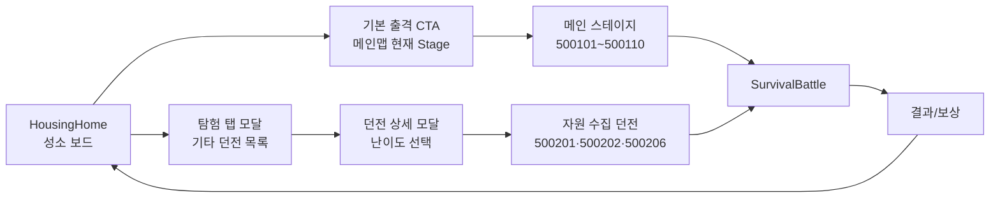

# 닌자 서바이벌 2 메인맵/던전 기획 v0

작성일: 2026-06-09  
목적: 현재 `ninja2` 콘텐츠 초안의 `500101~500110` 메인 스테이지를 기준으로, 플레이어가 보는 메인 탐험맵과 기타 던전 라인업을 확정 가능한 형태로 정리한다.

## 1. 핵심 판단

`ninja2`의 첫 MVP 메인맵은 월드맵/4X 전략맵이 아니라 `성소 밖 안개 숲 진행도`다. 기본 홈은 계속 `HousingHome`이고, 하단 기본 출격 CTA는 현재 메인 Stage로 들어가며, `탐험` 탭은 기본맵 외 던전 목록을 연다.

메인맵의 역할은 세 가지다.

- 메인 스테이지 10개를 한 줄 진행으로 보여준다.
- 하우징 병목을 풀 기타 던전을 곁가지로 붙인다.
- 각 던전의 보상이 어떤 건물/타일/동료 성장에 쓰이는지 즉시 읽게 한다.

첫 구현은 엔진 확장 없이 `ResourceMap.Type=Dungeon`과 `popupArgs`로 진행하고, 맵 선택 UI/노드 상태는 런타임 레이어에서 처리한다.

## 2. 화면 흐름

메인맵은 하단 기본 출격 CTA가 담당한다. 탐험 탭은 기본맵을 반복해서 보여주지 않고, 해금된 기타 던전 목록만 모달로 보여준다. 던전 행을 누르면 바로 입장하지 않고 던전 상세 모달로 이동해 난이도를 선택한 뒤 입장한다.

| 레이어 | 플레이어에게 보이는 것 | 시스템 역할 |
| --- | --- | --- |
| 성소 기준점 | 화면 하단 또는 좌측의 등불 신전 노드 | 홈 복귀, 현재 성소 Lv/생산 상태 요약 |
| 메인 루트 | 1장 `안개 숲 회랑` 10개 노드 | 새 스테이지, 최초 클리어, 하우징 확장 해금 |
| 사이드 게이트 | 자원, 보스, 정화, 방어 던전 | 특정 병목 파밍과 반복 플레이 목적 |
| 안개 영역 | 아직 잠긴 노드와 흐릿한 배경 | 신전 Lv, 스테이지 클리어, 건물 조건으로 개방 |

노드 상태는 `locked`, `fogged`, `new`, `cleared`, `farmable`, `boosted`, `firstClearClaimed` 7개면 충분하다.

## 3. 메인맵 챕터 구조

1장 이름은 `안개 숲 회랑`으로 둔다. 기존 데이터명은 대나무/그림자/가시 톤을 유지하되, 기획서에서는 성소 피벗에 맞춰 `대나무 영지 -> 안개 숲 -> 가시 폐허`로 자연스럽게 이어지는 첫 원정로로 설명한다.

| stage | map id | 이름 | 전투 역할 | wave | 고정 보상 축 | 해금/하우징 목표 |
| ---: | ---: | --- | --- | ---: | --- | --- |
| 1 | 500101 | 대나무 영지 입구 | 첫 출격, 자동공격/웨이브/보스 튜토리얼 | 3 | 골드 165, EXP 45, 목재 4 | 목재 작업장 건설/수령 |
| 2 | 500102 | 대나무 영지 외곽 | 2종 적 도입, 반복 파밍 시작 | 4 | 골드 265, EXP 70, 목재 6 | 수련마당 또는 목재 작업장 Lv2 |
| 3 | 500103 | 안개숲 초입 | 석재 고정 보상 도입 | 5 | 골드 405, EXP 105, 목재 8, 석재 1 | 신전 Lv2, 첫 타일 정화 후보 |
| 4 | 500104 | 안개숲 깊은길 | 웨이브 압박 증가 | 7 | 골드 615, EXP 150, 목재 10, 석재 2 | 채석장/영혼광맥 준비 |
| 5 | 500105 | 가면두령 초소 | 첫 중간 보스 관문 | 10 | 골드 900, EXP 210, 목재 12, 석재 3, 영혼불 1 | 보스 추적, 영혼광맥 해금 |
| 6 | 500106 | 영혼불 오솔길 | 희귀 재화 루프 확정 | 10 | 골드 1230, EXP 280, 목재 14, 석재 4, 영혼불 1 | 동료 스킬/신전 반경 성장 |
| 7 | 500107 | 그림자 나루 | 파밍 선택 필요 구간 | 10 | 골드 1620, EXP 360, 목재 16, 석재 5, 영혼불 2 | 정찰소/허브 정원 후보 |
| 8 | 500108 | 가시폐허 입구 | 폐허권 진입, 중반 재료 예고 | 10 | 골드 2080, EXP 450, 목재 18, 석재 6, 영혼불 2 | 공방/수호등탑 후보 |
| 9 | 500109 | 가시폐허 심층 | 1장 최종 전 압박 | 10 | 골드 2630, EXP 560, 목재 20, 석재 7, 영혼불 3 | ring 2 완성 목표 |
| 10 | 500110 | 가시두령 제단 | 1장 최종 보스 | 10 | 골드 3270, EXP 690, 목재 24, 석재 8, 영혼불 4 | 일일/주간 던전, 다음 장 예고 |

현재 보상 곡선은 메인 루프에 맞다. 초반 1~4스테이지는 석재/영혼불을 선택 보상으로 맛보게 하고, 5스테이지부터 영혼불을 고정 보상으로 보장한다. `ClientWaveCount`는 3 -> 4 -> 5 -> 7 -> 10으로 빠르게 올라가고, 5스테이지 이후에는 10웨이브를 유지해 보상과 적 밀도만 키운다.

주의할 점은 10개 맵이 같은 `ninja2_survival_main.behavior.yaml` 웨이브 템플릿을 공유한다는 것이다. D7 이후에는 맵별 개성을 위해 `stageTheme` 또는 전용 트리거를 추가해야 한다.

## 4. 기타 던전 라인업

기타 던전은 메인 루트보다 짧고 목적이 분명해야 한다. 보상은 항상 하우징의 특정 병목과 연결한다.

| 계열 | 예약 id | 해금 조건 | 플레이 목적 | 주요 보상 | 연결 Sink |
| --- | --- | --- | --- | --- | --- |
| 자원 수집 | 500201~500219 | 정찰소 또는 stage 3+ | 부족한 재료를 지정 파밍 | 목재, 석재, 영혼불, 허브, 철광석, 동료 조각 | 건물 Lv, 타일 정화, CompanionRoster |
| 보스 추적 | 500301~500309 | stage 5+ 및 보스 최초 처치 | 보스 재료와 동료 성장 토큰 | 영혼불, 동료 조각, 수호문양 | 동료 스킬, 수호등탑 |
| 안개 정화 | 500401~500409 | 신전 Lv/메인 stage 조건 | 헥스 타일 개방 전투 | 정화도, 타일 해금권, 석재 | 영지 ring 확장 |
| 성소 방어 | 500601~500609 | 수호등탑 또는 ring 2 | 거점 방어형 변형 전투 | 식량, 수호문양, 골드 | 수호등탑, 숙소 |
| 도전/랭크 | 500701~500799 | 1장 클리어 이후 | 주간 점수/고난도 빌드 시험 | 랭크 포인트, 루비, 꾸미기 | 장기 반복 목표 |

### 자원 수집

| id | 이름 | 수집 목적 | 전투 규칙 | 주 보상 | 해금 |
| ---: | --- | --- | --- | --- | --- |
| 500201 | 벌목로 | 건설 재료 | 2분 생존 또는 5웨이브 | 목재 대량, 골드 소량 | 500102 클리어, 목재 작업장 Lv2 |
| 500202 | 채석장 아래길 | 확장 재료 | 느린 적+엘리트 1마리 | 석재, 낮은 확률 영혼불 | 500103 클리어, 등불 신전 Lv2 |
| 500203 | 영혼불 균열 | 희귀 성장 재료 | 보스 1마리 중심 단기전 | 영혼불, 석재 | 500105 클리어, 영혼광맥 해금 |
| 500204 | 허브 습지 | 회복/지원 재료 | 독/지속피해 적, 회복 픽업 강조 | 허브, 식량 | 신전 Lv4, 허브 정원 해금 |
| 500205 | 철광 폐갱 | 공방 재료 | 장갑형 적, 폭탄/공방 스킬 권장 | 철광석, 도구 | 500108 클리어, 공방 Lv2 |
| 500206 | 동료 흔적 수집 | 동료 해금/승급 재료 | 빠른 적과 보급 상자 회수 | 동료 조각, EXP, 영혼불 소량 | 500106 클리어 또는 정찰소 해금 |

자원 수집은 EXP를 낮게 주고 특정 재료 기대값을 메인 스테이지의 2.0~2.8배로 둔다. 대신 최초 클리어 보상은 작게 하고, 반복 파밍처라는 성격을 명확히 한다.

동료 조각도 별도 구출 전용 계열을 만들지 않고 이 표 안에 둔다. 화면에서는 `동료 흔적`, `잃어버린 보급품`, `의식 파편` 같은 수집 목표로 보이게 하고, 캐릭터별 스토리 연출은 최초 획득/승급 팝업에서 처리한다.

### 보스 추적

| id | 이름 | 보스 역할 | 주 보상 | 해금 |
| ---: | --- | --- | --- | --- |
| 500301 | 가면두령 재추적 | 1장 중간 보스 재전 | 영혼불, 석재, 동료 조각 소량 | 500105 클리어 |
| 500302 | 그을음 큰정령 | 광역 장판/느린 추격 | 영혼불, 수호문양 | 500106 클리어 |
| 500303 | 보라 포자왕 | 소환/독 패턴 | 허브, 정화초 | 허브 정원 해금 |
| 500304 | 안개가시 수문장 | 돌진/방어막 | 수호문양, 철광석 | 수호등탑 해금 |
| 500305 | 가시두령 악몽 | 1장 최종 보스 강화판 | 영혼불 대량, 랭크 포인트 | 500110 클리어 |

보스 추적은 일일 제한 또는 입장권을 붙여도 좋다. D1에서는 만들지 않고, D7 검증에서 500301 하나만 먼저 구현한다.

### 안개 정화

안개 정화 던전은 메인맵과 하우징 보드 사이를 직접 잇는 던전이다. 클리어하면 `fogged -> expandable` 상태가 열리고, 실제 건설 슬롯 확보는 목재/석재 비용으로 한 번 더 진행한다.

| id | 이름 | 규칙 | 결과 |
| ---: | --- | --- | --- |
| 500401 | 작은 안개틈 | 3웨이브 방어 | ring 1 타일 1개 정화 후보 |
| 500402 | 숲 가장자리 정화 | 5웨이브, 픽업 회수 | ring 1 타일 2개 정화 후보 |
| 500403 | 등불 경계선 | 타이머 생존 | ring 2 안개 후보 노출 |
| 500404 | 폐허 길목 정화 | 엘리트 처치 | 정찰소/수호등탑 주변 타일 |

이 계열의 보상은 재화보다 공간이다. 결과 화면에는 재화 보상보다 `새 타일 후보`, `새 건물 슬롯`, `정화도 +N`을 먼저 보여준다.

### 성소 방어

성소 방어는 하우징을 꾸민 이유를 전투로 되돌려주는 변형이다. 기본 전투가 바깥 숲으로 나가는 원정이라면, 성소 방어는 적이 성소 경계로 밀려오는 상황이다.

| id | 이름 | 규칙 | 주 보상 | 해금 |
| ---: | --- | --- | --- | --- |
| 500601 | 등불 경비 | 3분 방어, 신전 HP 보호 | 골드, 식량 | 수호등탑 건설 |
| 500602 | 작업장 방어 | 생산 건물 보호 | 목재, 도구 | 공방 해금 |
| 500603 | 안개 습격 | 다수 웨이브+보스 | 수호문양, 영혼불 | ring 2 후반 |

성소 방어는 UI/런타임 난도가 높으므로 첫 데이터는 일반 `Dungeon`으로 만들고, 표현만 성소 방어처럼 시작한다.

## 5. 진행 해금표

| 시점 | 열리는 맵/던전 | 의도 |
| --- | --- | --- |
| D1 시작 | 500101 | 한 판으로 목재 작업장 건설 감각 제공 |
| 500102 클리어 | 500201 벌목로 후보 | 목재 병목을 플레이어가 선택해서 풀게 함 |
| 500103 클리어 | 500202 채석장 아래길, 500401 작은 안개틈 후보 | 석재와 타일 정화 루프 도입 |
| 500105 클리어 | 500301 가면두령 재추적, 500203 영혼불 균열 후보 | 영혼불/보스 재료 장기 목표 시작 |
| 신전 Lv4 | 500204 허브 습지, 500206 동료 흔적 수집 후보 | 회복/동료/지원 계열 확장 |
| 500108 클리어 | 500205 철광 폐갱, 500206 고난도 보상 단계 | 공방/도구/중반 재료 도입 |
| 500110 클리어 | 500305 가시두령 악몽, 500701 주간 도전 후보 | 1장 반복 목표와 다음 장 예고 |

## 5.1 던전 UI 에셋 바인딩

기타 던전 목록/상세 모달의 임시 glyph는 `ninja2.ui.dungeon_icon_set.resource_collection_v1` 아이콘 세트로 교체한다. 아이콘은 고정 투명 스프라이트이며, 던전명/난이도/보상량/잠금 배지는 native text/UI로 유지한다.

| map id | 던전 | icon asset |
| ---: | --- | --- |
| 500201 | 벌목로 | `icon_dungeon_woodcutting_trail` |
| 500202 | 채석장 아래길 | `icon_dungeon_stone_underpass` |
| 500206 | 동료 흔적 수집 | `icon_dungeon_companion_traces` |

## 6. 구현 메모

- 현재 메인 10개 맵은 `harness/content/ninja2/maps/_drafts/500101~500110_*.map.yaml`에 존재한다.
- 현재 메인 맵 인덱스의 시리즈 키는 `ninja2-survival-housing-10`이다.
- 기타 던전은 새 시리즈를 분리한다: `ninja2-resource-collection`, `ninja2-boss-pursuit`, `ninja2-fog-purification`, `ninja2-sanctuary-defense`.
- 공통 보드/지형은 메인 맵과 같은 12 x 6 전장으로 시작해도 된다.
- 트리거는 계열별로 하나씩 만든다: `ninja2_resource_collection.behavior.yaml`, `ninja2_boss_pursuit.behavior.yaml`, `ninja2_fog_purification.behavior.yaml`.
- D7까지는 모든 던전을 `Dungeon`으로 두고, 방어/랭크/이벤트 타입은 런타임과 검증이 안정된 뒤 바꾼다.
- 입장권은 기존 `energy` item 8을 `등불` 표시명으로 쓰는 방향이 자연스럽지만, D1에서는 무료 입장으로 막지 않는다.

## 7. 다음 제작 순서

1. 기본 출격 CTA에서 현재 메인맵 Stage를 보여주고 바로 500101~500110 진행으로 들어간다.
2. 탐험 탭 모달에는 500201, 500202, 500206 자원 수집 던전만 먼저 draft로 연결한다.
3. 던전 클릭 후 상세 모달에서 초급/중급/상급 난이도를 선택하고, 상세 모달의 입장 버튼에서만 전투로 들어간다.
4. 각 기타 던전의 보상이 `housing-building-tech-v0.yaml`의 실제 비용 병목을 풀 수 있는지 시뮬레이션한다.
5. 정찰소가 지어졌을 때 자원 수집 보상 미리보기/집중 파밍 UI를 연다.
6. 500401 안개 정화 던전과 하우징 타일 상태 변화를 연결한다.
7. 1장 클리어 후 500305 또는 500701을 열어 장기 반복 목표를 만든다.
