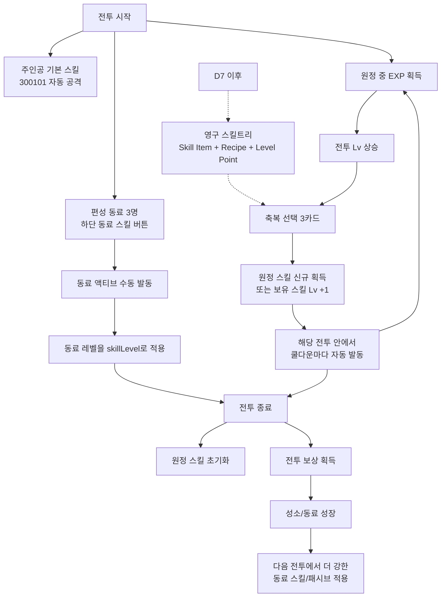

# 닌자 서바이벌 2 시스템 설계 v0

작성일: 2026-06-03  
목적: `이세계 전이 + 여성 동료 + 성소 하우징 + 숲 서바이벌` 방향에서 첫 기획서에 들어갈 핵심 시스템을 확정한다.

## 1. 시스템 한 줄 정의

플레이어는 이세계 성소의 임시 관리자가 되어 여성 동료를 모으고, 성소 건물을 성장시키고, 숲 서바이벌 전투에 출격해 자원과 동료 성장 재료를 회수한다.

첫 버전의 핵심은 `전투 1판 -> 귀환 보상 -> 성소/동료 강화 -> 다음 출격`이다.

## 2. MVP 시스템 우선순위

### D1 필수

- `SurvivalBattle`: 1개 전투 화면, 1개 스테이지, 자동 공격, 웨이브, 보스, 전투 결과.
- `HousingHome`: 1개 성소 홈, 3개 생산 건물, 수령/업그레이드.
- `CompanionRoster`: 여성 동료 3명, 편성 3슬롯, 동료 스킬 3개.
- `CoreEconomy`: 골드, 경험치, 목재, 석재, 영혼불.
- `Progression`: 플레이어 레벨, 성소 레벨, 건물 레벨, 동료 레벨.
- `Mission`: 튜토리얼/초기 미션 5~8개.

### D7 검증

- 메인 스테이지 10개.
- 여성 동료 5~7명.
- 동료별 스킬 레벨업과 하우징 패시브.
- 헥스 보드 2링 확장.
- 생산 건물 6~8종.
- 일일 미션/출석.
- 전투-하우징 병목 밸런스 검증.

### 보류

- 실시간 다중 동료 AI 전투.
- 풀 4X/동맹/월드맵.
- 장비 6부위 풀세트.
- 유료 중심 동료 가챠.
- 복잡한 호감도/데이트/대화 분기.
- 자유 배치 하우징.

## 3. 화면과 시스템 구조

### 메인 화면

- `HousingHome`: 기본 홈 화면.
- 상단: 플레이어 레벨, 성소 레벨, 주요 재화.
- 중앙: 헥스 성소 보드, 건물, 생산 말풍선, 안개 타일.
- 하단 탭: `성소`, `동료`, `탐험`, `임무`, `상점`.
- 주요 CTA: `탐험 출발`.

### 전투 화면

- `SurvivalBattle`: 별도 전투 화면.
- 자동 공격은 항상 켜져 있다.
- 하단에는 주인공 기본 스킬 1개와 동료 스킬 3개를 둔다.
- 전투 중 레벨업 선택지는 `축복 선택`으로 표현한다.
- 결과 화면은 처치 수, 생존 시간, 획득 자원, 동료 경험치를 보여준다.

### 동료 화면

- 여성 동료 roster.
- 각 동료는 전투 스킬, 하우징 직무, 패시브 보너스를 가진다.
- D1은 동료 장비/복잡한 호감도 없이 레벨업과 편성만 둔다.
- D7에서 조각 승급, 호감도 1차 보상, 전용 스토리 카드까지 확장한다.

## 4. 상단/하단 UI 구성

### 공통 UI 원칙

- 세로형 9:16 기준으로 상단은 상태 확인, 하단은 조작과 전환을 담당한다.
- 상단 UI는 플레이 중 계속 보여도 되는 정보만 둔다: 레벨, HP, 웨이브, 타이머, 핵심 재화.
- 하단 UI는 현재 맥락의 행동을 우선한다: 출격, 수령, 업그레이드, 스킬 사용, 탭 이동.
- 중앙 플레이 공간은 항상 비워둔다. 하우징에서는 헥스 보드와 건물, 전투에서는 주인공/적/드롭이 가려지면 안 된다.
- 재화는 아이콘 + 숫자 칩으로 표시하고, 긴 이름은 표시하지 않는다.
- 상단/하단 고정 UI는 safe area 안에 두고, 모달/보상 팝업이 뜰 때만 어둡게 비활성화한다.

### HousingHome 상단 UI

목적: 성소 상태와 자원 상태를 빠르게 읽게 한다.

| 위치 | 구성 | 기능 |
| --- | --- | --- |
| 좌상단 | 메뉴 버튼, 주인공 초상, 플레이어 Lv | 계정/설정/프로필 진입, 플레이어 성장 확인 |
| 상단 중앙 | 성소 이름, 성소 Lv, 정화도/성장 단계 | 현재 홈의 장기 성장 목표 표시 |
| 우상단 | 골드, 목재, 석재, 영혼불, 루비 | 업그레이드 판단에 필요한 핵심 재화 표시 |
| 상단 보조줄 | 미션 1개, 수령 가능 알림, 우편/이벤트 작은 아이콘 | 다음 행동 유도 |

규칙:

- 우상단 재화는 D1에서 최대 4개 + 루비까지만 노출한다.
- 재화가 부족할 때는 해당 칩만 짧게 흔들거나 붉은 외곽선으로 반응한다.
- 성소 Lv를 상단 중앙에 고정해, 하우징이 단순 배경이 아니라 메인 성장축임을 계속 보여준다.
- 미션은 한 줄만 보여주고, 긴 설명은 임무 화면으로 보낸다.

### HousingHome 하단 UI

목적: 건물 조작, 동료 편성, 출격을 빠르게 수행하게 한다.

| 위치 | 기본 상태 | 건물 선택 상태 |
| --- | --- | --- |
| 하단 좌측 | 빠른 수령 버튼 | 선택 건물 생산량/남은 시간 |
| 하단 중앙 | `성소`, `동료`, `탐험`, `임무`, `상점` 탭 | 선택 건물 이름, Lv, 효과 요약 |
| 하단 우측 | 큰 `탐험 출발` CTA | `수령`, `업그레이드`, `이동/해제` 버튼 |
| 하단 위 레이어 | 편성 동료 3명 작은 초상 | 업그레이드 비용과 부족 재료 표시 |

규칙:

- 아무 건물도 선택하지 않았을 때는 `탐험 출발`이 가장 강한 버튼이다.
- 건물을 선택하면 하단에 compact inspector를 열고, `탐험 출발`은 작게 접거나 우측 위로 밀어둔다.
- 하단 탭은 아이콘 + 짧은 한글 2~3자 라벨을 쓴다.
- `동료` 탭에는 편성 슬롯 3개와 성장 알림 dot을 우선 노출한다.
- 건설 모드에서는 하단 중앙이 탭바가 아니라 건물 카탈로그로 바뀐다.

### SurvivalBattle 상단 UI

목적: 생존 상태와 스테이지 진행을 즉시 읽게 한다.

| 위치 | 구성 | 기능 |
| --- | --- | --- |
| 좌상단 | 일시정지, 주인공 초상, HP 바, 현재 전투 Lv | 생존 상태 확인 |
| 상단 중앙 | 스테이지 번호, 웨이브, 타이머 | 승리 조건과 진행도 확인 |
| 우상단 | 골드, 목재/석재, 영혼불 획득량 | 이번 전투 보상 피드백 |
| 상단 전체 얇은 바 | EXP 바 또는 웨이브 진행 바 | 레벨업 임박/웨이브 압박 표시 |
| 보스 등장 시 | 보스 HP 바 | 보스전 목표 집중 |

규칙:

- 전투 중 상단 재화는 누적 획득량만 보여주고, 전체 보유 재화는 보여주지 않는다.
- HP 바와 타이머는 가장 큰 정보다. 장식보다 가독성을 우선한다.
- 보스 HP 바는 보스 등장 중에만 상단 중앙 아래에 나타난다.
- 상단 UI 높이는 적 스폰과 피해 숫자를 가리지 않도록 얇게 유지한다.

### SurvivalBattle 하단 UI

목적: 이동과 스킬 사용을 손가락 위치에 맞춰 고정한다.

| 위치 | 구성 | 기능 |
| --- | --- | --- |
| 하단 좌측 | 반투명 조이스틱 | 이동 |
| 하단 중앙 | 주인공 기본 스킬 상태, 자동 공격 표시 | 현재 전투 스타일 확인 |
| 하단 우측 | 동료 스킬 3개 원형 버튼 | 액티브 스킬 사용/쿨다운 확인 |
| 최하단 얇은 바 | EXP 바 | 레벨업 진행 확인 |
| 하단 위 팝업 | 축복 선택 3개 | 전투 레벨업 선택 |

규칙:

- 동료 스킬 버튼은 각 동료 초상 + 쿨다운 링 + 속성 색상으로 구분한다.
- 스킬 버튼은 3개 고정으로 시작한다. D7 이후에도 4개를 넘기지 않는다.
- 조이스틱과 스킬 버튼은 중앙 전투 공간을 침범하지 않는다.
- 축복 선택이 뜨면 전투를 일시 정지하고 하단 위 3카드로 표시한다.
- 보상/레벨업 연출은 하단 조작부를 밀어내지 않고 별도 오버레이로 띄운다.

### Result/Reward 하단 UI

전투 결과 화면은 하단에 `한 번 더`, `성소로`, `강화하기` 3개 행동만 둔다.

- `강화하기`: 업그레이드 가능한 동료나 건물이 있을 때 우선 강조.
- `성소로`: 기본 귀환.
- `한 번 더`: 같은 스테이지 재도전.

상단에는 승리/패배, 스테이지명, 생존 시간, 처치 수만 둔다. 보상 목록은 중앙에 둔다.

### UI에서 하지 않을 것

- 하우징 홈 상단에 모든 재화를 다 노출하지 않는다.
- 전투 화면 하단에 탭바를 넣지 않는다.
- 하우징 화면 중앙에 긴 설명 텍스트를 얹지 않는다.
- 전투 중 동료 3명의 전신 일러스트를 계속 띄우지 않는다.
- 첫 버전에 채팅, 동맹, 랭킹 버튼을 상단 고정으로 넣지 않는다.

## 5. 코어 루프 시스템

1. 성소 홈에서 생산 자원을 수령한다.
2. 건물과 동료의 업그레이드 가능 상태를 확인한다.
3. 여성 동료 3명을 편성한다.
4. `탐험 출발`로 숲 전투에 진입한다.
5. 전투 중 자동 공격과 동료 스킬로 웨이브를 막는다.
6. EXP를 모아 전투 내 축복을 선택한다.
7. 보스 또는 타이머 조건을 넘기면 귀환한다.
8. 전투 보상으로 건물/동료/성소를 강화한다.
9. 다음 스테이지 또는 더 높은 난이도에 출격한다.

## 6. 전투 시스템

### 전투 기본값

- 화면: 세로형 9:16, top-down 2D.
- 입력: 이동 조이스틱 + 스킬 버튼. 자동 공격 기본.
- 승리 조건 D1: 3웨이브 클리어 후 보스 처치.
- D7 확장: `3분 생존`, `보스 처치`, `자원 회수`, `거점 방어` 변형.
- 실패 조건: 플레이어 HP 0.
- 전투 길이 D1: 90~150초.
- 전투 길이 D7 일반 스테이지: 3~5분.

### 스킬 구조

- 주인공 기본 스킬: 짧은 쿨다운의 자동 공격.
- 원정 스킬: 전투 중 레벨업으로 선택하고, 해당 전투 안에서 자동 발동되는 임시 스킬.
- 동료 액티브: 편성한 동료 3명의 수동 스킬 버튼.
- 전투 밖 영구 강화: D1에서는 동료 레벨/스킬 레벨만 두고, 별도 스킬트리는 D7 이후로 미룬다.

### 스킬 시스템 한눈에 보기

| 구분 | 전투 중 표시 | 조작 | 성장 방식 | 전투 종료 후 |
| --- | --- | --- | --- | --- |
| 주인공 기본 스킬 | HUD 스킬 목록/자동 공격 상태 | 자동 | 캐릭터/스탯 성장 영향 | 유지 |
| 원정 스킬 | 레벨업 3카드, HUD 습득 스킬 | 선택 후 자동 발동 | 전투 중 Lv.1~5 | 초기화 |
| 동료 액티브 | 하단 동료 스킬 3버튼 | 수동 발동 | 동료 레벨이 skillLevel로 반영 | 유지 |
| 동료 패시브 | 홈/전투 보너스 | 자동 적용 | 동료 레벨/소환 상태 | 유지 |
| 영구 스킬트리 | D7 이후 성장 화면 | 레벨 포인트 소비 | Skill Item/Recipe | 유지 |

핵심 판단:

- D1의 재미는 `전투 중 3카드 선택`과 `동료 스킬 버튼 3개`에 집중한다.
- D1에서는 영구 스킬트리를 열지 않는다.
- 원정 스킬은 매 판 새로 빌드를 만드는 재미, 동료 스킬은 roster 성장의 보상을 담당한다.
- 동료가 전장에 상주하지 않아도 스킬 버튼과 패시브로 존재감을 만든다.

### 현재 구현 확인

현재 하네스/런타임에는 인게임 스킬 시스템의 뼈대가 이미 있다.

- `ResourceSkill`: 스킬 효과는 `timelines[]`와 `selfAddBuffs`/`hit.addBuffs`로 정의한다.
- 기본 공격: 플레이어 유닛 행동이 `useSkillToTarget: 300101`을 호출한다.
- 원정 레벨업: `playerLevelChanged` 이벤트가 뜨면 `levelUpChoiceCount: 3`에 맞춰 3개 선택지를 연다.
- 원정 스킬 레벨: 한 전투 안에서 스킬별 `Lv.1~5`를 가진다. 전투가 끝나면 초기화된다.
- 원정 스킬 자동 발동: 선택한 스킬은 쿨다운마다 자동 시전된다.
- 쿨다운 보정: `ResourceSkill.cooldown`에 `CooldownPercent`를 반영한다.
- 동료 스킬: `companionSkillDock`에 동료별 버튼 3개가 있고, 해금/쿨다운/READY 상태를 표시한다.
- 동료 스킬 레벨: 동료 레벨을 `skillLevel`로 넘긴다.
- 레벨업 UI: `levelModal`/`choiceGrid`가 3카드 선택지를 보여준다.
- 전투 HUD: `profileSkillList`가 현재 배운 원정 스킬과 기본 패시브 표시를 담당한다.

### 축복 선택

전투 안에서만 유지되는 임시 선택지다. 현재 구현명은 `level choice`지만, 기획서에서는 `축복 선택` 또는 `원정 스킬 선택`으로 부른다.

확정 규칙:

- 선택지는 항상 3개.
- 새 스킬과 보유 스킬 강화가 함께 나온다.
- 같은 스킬은 최대 Lv.5.
- 선택 즉시 1회 발동하고, 이후 쿨다운마다 자동 발동된다.
- 선택 중에는 전투를 일시 정지한다.
- 선택지는 전투 종료 시 사라진다.

초기 축복/원정 스킬 풀:

| id | 이름 | 역할 | 기획 분류 |
| --- | --- | --- | --- |
| 300101 | 쿠나이 베기 | 기본 근접 자동타 | 기본기 |
| 300102 | 표창 난사 | 빠른 단일/소형 투사체 | 연사 |
| 300103 | 연막 폭탄 | 광역 피해 + 둔화 | 제어 |
| 300104 | 그림자 호흡 | 공속/쿨감/이속 자기 강화 | 버프 |
| 300105 | 회전 수리검 | 주변 방어링 | 생존 광역 |
| 300106 | 번개 쿠나이 | 랜덤 타겟 연쇄 피해 | 연쇄 |
| 300107 | 화염 두루마리 | 장판 반복 피해 | 장판 |
| 300108 | 냉혈 침술 | 보스 제어/고화력 | 보스 |
| 300109 | 그림자 분신 | 다단 타격 | 분신 |
| 300110 | 월광 일섬 | 보스 누킹 | 보스 |
| 300111 | 대나무 창비 | 랜덤 광역 낙하 | 광역 |
| 300112 | 흑련 폭풍 | 궁극 광역 | 궁극 |
| 300113 | 살의 집중 | 공격/치명 자기 강화 | 버프 |
| 300114 | 시간 접기 | 쿨감/공속 자기 강화 | 버프 |
| 300115 | 질풍 보법 | 이동/공속 자기 강화 | 기동 |
| 300116 | 약점 표식 | 받는 피해 증가 디버프 | 보스 디버프 |

### 동료 액티브 스킬

D1 동료 3명은 전장에 상주하는 AI 유닛이 아니라 하단 버튼형 스킬로 시작한다.

| 동료 | 현재 스킬 id | 현재 스킬명 | 쿨다운 | 추가 효과 |
| --- | ---: | --- | ---: | --- |
| 카에데 | 300102 | 표창 난사 | 4.2초 | 목재 보상 패시브 |
| 미오 | 300104 | 그림자 호흡 | 8.0초 | 시전 시 추가 회복/보호막 연출 |
| 린 | 300107 | 화염 두루마리 | 6.4초 | 건물 강화 비용 감소 패시브 |

기획 보완:

- 카에데는 `표창 난사`를 그대로 써도 된다. 정찰 닌자 정체성과 맞다.
- 미오는 `그림자 호흡`보다 `등불 보호막` 표시명이 더 좋다. 내부 skill id는 유지해도 UI 표시명은 동료 스킬명으로 덮어쓴다.
- 린은 `화염 두루마리`보다 `공방 폭탄` 표시명이 더 좋다. 내부 skill id는 유지해도 UI 표시명은 동료 스킬명으로 덮어쓴다.
- 동료 스킬 버튼은 동료 초상, 이름, READY/쿨다운, 속성색을 보여준다.
- 동료 스킬은 수동 발동으로 유지한다. 자동 발동은 D7 이후 옵션으로 검토한다.

### 전투 밖 스킬 성장

현재 엔진 계약에는 `Item.category: Skill` + `ResourceSkill.skillDataId` + `Recipe` + `LevelUpItem` 업적으로 만드는 영구 스킬트리 경로가 있다. 다만 D1에서는 복잡도가 커지므로 사용하지 않는다.

D1:

- 원정 스킬은 전투 중 임시 성장만 사용한다.
- 동료 스킬은 동료 레벨에 따라 강해진다.
- 별도 스킬북/레시피/레벨포인트는 만들지 않는다.

D7:

- 스킬 아이템을 열어 영구 해금/강화로 확장한다.
- 플레이어 레벨업마다 `레벨 포인트`를 주고, 스킬 레시피로 새 스킬을 해금한다.
- `RequiredPlayerLevel`, `RequiredSkillLevel`, `UnlockCostLevelPoint`를 popupArgs 계약으로 관리한다.
- 원정 선택지는 보유/해금한 스킬 풀에서 나온다.

### 스킬 시스템 수정/보완안

- 현재 스킬명은 닌자색이 강하다. 이세계 성소 방향에 맞춰 표시명 일부를 조정한다.
- `쿠나이/표창/분신/연막`은 닌자 전투술로 유지한다.
- `그림자 호흡`, `화염 두루마리`, `흑련 폭풍`은 성소/등불/영혼불 계열 이름으로 바꾸는 후보를 둔다.
- 동료 스킬명은 동료 판타지를 우선한다. 내부 `ResourceSkill.name`과 다르게 UI 표시명을 쓸 수 있다.
- 스킬 선택 화면 문구는 `레벨 업!`보다 `축복 선택` 또는 `원정 성장`이 세계관에 맞다.
- `damagePercent` 5단계 배열은 현재처럼 유지한다. 기획상 원정 스킬 Lv.1~5와 정확히 대응한다.
- D1에서는 16개 풀 전체를 바로 열지 않고, 스테이지/성소/동료 해금에 따라 선택 풀을 단계적으로 연다.

초기 해금 제안:

| 해금 시점 | 원정 선택 풀 |
| --- | --- |
| 시작 | 300101, 300102, 300103, 300115 |
| 미오 합류 | 300104, 300113, 300114 |
| 린 합류 | 300107, 300105 |
| 성소 Lv.3 | 300106, 300108, 300116 |
| D7 이후 | 300109~300112 상위 스킬 |

### 적 구성

D1:

- 일반 적 1: 잎가면 임프. 빠르고 약함.
- 일반 적 2: 숯정령. 느리지만 체력 높음.
- 보스 1: 안개 두령. 넓은 근접 공격.

D7:

- 일반 적 6종.
- 엘리트 3종.
- 보스 3종.
- 각 챕터마다 재료 드롭 특화 적 1종.

## 7. 동료 시스템

### 확정 방향

동료는 전원 여성이다. D1에서는 전장에 상주하는 독립 AI 유닛이 아니라 `동료 카드 + 동료 액티브 스킬 + 하우징 패시브`로 구현한다. 이렇게 하면 화면 혼잡도와 AI 비용을 줄이면서도 수집형 캐릭터의 존재감은 살릴 수 있다.

### 동료 데이터 구조

동료 1명은 다음 요소로 구성한다.

- 동료 카드: 보유/레벨/등급/조각 상태.
- 동료 스킬: 전투 중 사용하는 `ResourceSkill`.
- 하우징 직무: 특정 건물 생산량 또는 수령량 보너스.
- 탐험 보너스: 특정 자원 드롭, EXP, 보스 피해 등.
- 스토리 태그: 이세계 도입, 성소, 닌자술, 공방, 사제, 기사 등.

### 엔진 매핑

- 동료 카드: `Item.Category=Unit` 또는 `Item.Category=Character` 후보. D1 권장은 `Unit` 계열 아이템으로 별도 roster를 만든다.
- 동료 스킬: `ResourceSkill` + `Item.Category=Skill`.
- 동료 레벨: 동료 카드 아이템의 레벨 또는 grade.
- 동료 조각: `Item.Category=Material`.
- 하우징 보너스: `Item.Category=Stat`, `Buff`, 또는 업적 보상으로 표현한다.
- 동료 획득: `용병 훈련소`의 랜덤 소환 결과로 보유 상태가 된다. 업적, 스테이지 클리어, 성소 레벨은 동료를 직접 지급하지 않고 가챠 풀 편입 조건으로만 쓴다.

### D1 동료 3명

| 동료 | 역할 | 전투 스킬 | 하우징 보너스 | 가챠 풀 편입 |
| --- | --- | --- | --- | --- |
| 카에데 | 정찰 닌자 | 잎부적 투척 | 탐험 보상 목재 증가 | 시작 풀, 첫 소환 무료 |
| 미오 | 등불 사제 | 보호막/회복 | 성소 생산 속도 증가 | Stage 1 정화 후 풀 편입 |
| 린 | 공방 기술자 | 폭탄 설치 | 건물 업그레이드 비용 감소 | 등불 신전 Lv 2 후 풀 편입 |

### D7 동료 후보

| 동료 | 역할 | 시스템 포지션 |
| --- | --- | --- |
| 아야메 | 그림자 쿠노이치 | 치명타/분신/보스 피해 |
| 세라 | 수호 기사 | 방어/도발/거점 방어 |
| 유즈 | 약초 정원사 | 지속 회복/허브 생산 |
| 노아 | 이세계 학자 | EXP/축복 선택지 보정 |

### 동료 성장

D1:

- 레벨업: 골드 + 동료 경험치.
- 스킬 강화: 영혼불 + 동료 조각.
- 편성 슬롯: 3개 고정.

D7:

- 등급/성급: 조각으로 승급.
- 호감도: 선물 재료로 5단계. 각 단계는 대사/소량 스탯/하우징 장식 해금.
- 전용 임무: 특정 동료 편성 후 스테이지 클리어.

## 8. 하우징 시스템

### 핵심 구조

- 중앙 건물: `등불 신전`.
- 헥스 보드: 고정 좌표, 자유 배치 없음.
- 타일 상태: built, selected, empty, locked, fogged, expandable.
- 건물은 생산 노드이자 성장 목표다.
- 하우징은 전투 보상의 사용처이며, 동시에 전투 보너스의 공급처다.

### 엔진 매핑

- 생산 건물: `Item.Category=Mine`.
- 건물 강화 재료: `Item.Category=Material`.
- 건물 레벨업 비용: `levelUpMaterialItemGroups`.
- 생산 수령: `sellAddItemGroups` 또는 별도 runtime 수령 규칙.
- 패시브 전투 보너스: `Stat` 아이템, `Buff`, 업적 보상 중 가능한 경로를 우선 사용.
- 시각 건물: 2D sprite atlas. 필요 시에만 `Unit.Type=Building`.

### D1 건물

| 건물 | 기능 | 생산/효과 |
| --- | --- | --- |
| 등불 신전 | 중앙 성장 | 성소 레벨, 타일 확장, 동료 슬롯 유지 |
| 목재 작업장 | 생산 | 목재 |
| 수련마당 | 성장 | 플레이어/동료 경험치 |
| 영혼광맥 | 희귀 생산 | 영혼불/영혼석 |

### D7 건물

- 허브 정원: 회복/미오 성장 재료.
- 공방: 스킬 강화 재료와 린 보너스.
- 정찰소: 출격 보상 미리보기와 카에데 보너스.
- 수호탑: 방어형 스테이지 보너스.
- 숙소: 동료 호감도/오프라인 보상.

## 9. 경제 시스템

### 통화와 재료

| 자원 | 용도 | 획득 |
| --- | --- | --- |
| 골드 | 기본 강화, 건물 레벨업 | 전투, 생산, 미션 |
| 경험치 | 플레이어 레벨 | 전투, 수련마당 |
| 목재 | 건물 건설/확장 | 전투, 목재 작업장 |
| 석재 | 건물 레벨업, 타일 정화 | 전투, 채석 계열 |
| 영혼불 | 동료 스킬/희귀 강화 | 보스, 영혼광맥 |
| 동료 조각 | 동료 승급/중복 보상 보조 | 스테이지, 미션, 용병 훈련소 중복 소환 |
| 에너지 | 출격 제한/보상 배율 | 시간 회복, 보상 |
| 루비 | 편의/스킨/패키지 | 과금, 업적 |

### D1 경제 규칙

- 출격 1회는 반드시 목재 또는 석재를 준다.
- 보스는 낮은 확률 또는 최초 클리어 보상으로 영혼불을 준다.
- 건물 3종은 각자 다른 병목을 만든다.
- 첫 30분은 막히지 않고 `전투 -> 건물 업그레이드 -> 가챠 풀 확장 -> 새 동료/스킬`을 경험해야 한다.
- 오프라인 보상은 8시간 cap.

### 병목 설계

- 초반 병목: 목재.
- 중반 병목: 석재.
- 동료 강화 병목: 영혼불 + 동료 조각.
- 확장 병목: 성소 레벨 + 안개 정화 비용.

## 10. 성장 시스템

### 성장 축

- 플레이어 레벨: 기본 스탯과 축복 선택 풀 해금.
- 동료 레벨: 동료 스킬 피해/효과 증가.
- 동료 등급: 패시브와 스킬 부가 효과 해금.
- 성소 레벨: 건물 cap, 타일 확장, 동료 가챠 풀과 기능 개방.
- 건물 레벨: 생산량, 오프라인 보상, 전투 보너스.
- 스테이지 진행도: 새 재료, 새 동료 가챠 풀, 새 건물 개방.

### 스탯 규칙

사용 스탯은 `ninja2.profile.yaml`의 `stats.use` 안에서만 고른다.

D1 주력:

- Hp
- Attack
- Defense
- CriticalPercent
- CriticalDamagePercent
- AttackSpeed
- MoveSpeed
- CooldownPercent
- ExpPercent
- ItemDropPercent
- BossDamageEfficiencyPercent
- ScalePercent

### 레벨 cap

- 플레이어: 160.
- D1 동료: 20.
- D7 동료: 60.
- D1 건물: 5.
- D7 건물: 20.
- D1 성소: 3.
- D7 성소: 10.

## 11. 미션/해금 시스템

### 튜토리얼 미션 D1

1. 첫 전투 출격.
2. 첫 웨이브 클리어.
3. 목재 수령.
4. 목재 작업장 Lv 2.
5. 용병 훈련소 첫 소환.
6. 미오 가챠 풀 편입.
7. 영혼광맥 건설.
8. 성소 Lv 2.

### 해금 순서 D1

1. 게임 시작: 주인공 + 등불 신전 + 목재 작업장 + 용병 훈련소, 카에데가 가챠 풀에 들어간다.
2. 첫 용병 소환: 무료 랜덤 소환으로 카에데를 획득한다. 이후 중복은 동료 경험치로 전환한다.
3. 1스테이지 정화: 미오가 용병 훈련소 가챠 풀에 들어간다.
4. 성소 Lv 2: 린이 용병 훈련소 가챠 풀에 들어가고 다음 생산 건물 성장이 열린다.
5. 영혼광맥 수령: 동료 스킬 강화 재화를 확보한다.

### 엔진 매핑

- 미션: `ResourceAchievement`.
- 조건: `WinGame`, `AcquireItem`, `HasItemLevel`, `LevelUpItem`, `UseSkill`.
- 자동 보상: `autoReward: true`.
- 잠금: `requiredAchievementDataIds`.

## 12. 상점/수익화 시스템

D1에서는 상점은 시스템 검증용만 둔다.

- 무료 골드 팩.
- 무료/광고형 에너지 회복.
- 스타터 패키지 placeholder.

D7 이후:

- 동료 조각 패키지.
- 성소 스킨.
- 동료 코스튬.
- 월정액/광고 제거.
- 시즌 패스.

동료 획득을 첫날부터 유료 가챠 중심으로 만들지 않는다. D1 동료 3명은 용병 훈련소의 인게임 재화 랜덤 소환으로 얻고, 진행도 보상은 직접 지급이 아니라 가챠 풀 편입으로 처리한다.

## 13. 4X 확장 선

4X는 MVP 시스템이 아니다.

D7 이후 다음 요소만 확장 여지로 남긴다.

- 성소가 월드맵의 한 거점으로 표시된다.
- 안개 타일이 지역 정화/영토 확장으로 커진다.
- 동료 파견이 채집/정찰/방어 임무로 확장된다.
- 동맹은 성소끼리 연결되는 후반 시스템으로 둔다.

## 14. 확정할 남은 질문

1. 주인공 성별: 남성 고정, 성별 선택 가능, 묘사 약한 플레이어 대리자 중 무엇으로 갈지.
2. 동료 카드의 엔진 Category: `Unit`으로 갈지, `Character`로 갈지.
3. 전투 승리 조건 D1: 보스 처치 확정인지, 2분 생존 확정인지.
4. `석재`와 `영혼불` 명칭을 확정할지.
5. 동료 호감도를 D7에 넣을지, D14 이후로 미룰지.

## 15. 현재 권장 확정안

- 주인공: 묘사 약한 플레이어 대리자. 스토리는 2인칭/이름 입력으로 처리.
- 동료 카드: `Item.Category=Unit` 권장.
- D1 전투 승리: 3웨이브 + 보스 처치.
- D1 동료: 카에데, 미오, 린.
- D1 재화: 골드, 경험치, 목재, 석재, 영혼불.
- D1 하우징: 등불 신전, 목재 작업장, 수련마당, 영혼광맥.
- D1 수익화: 없음 또는 무료 팩 placeholder만.
