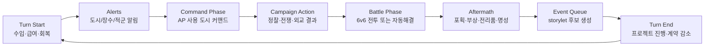

# City Command and Battle v0

작성일: 2026-06-21

목적: VN 이벤트와 장수 루트를 만들기 전에, 매 턴 플레이어가 실제로 누르는 도시 커맨드와 전투 흐름을 먼저 확정한다. 이벤트는 이 결과에 붙는 후속 반응이어야 한다.

## 1. 우선순위 변경

현재 MVP 우선순위는 다음으로 바꾼다.

```text
1. 도시 커맨드
2. 6v6 전투
3. 전투 후처리: 포획/부상/전리품/명성
4. storylet 이벤트
5. 장수 개인 루트
```

이유:

- 장수 이벤트는 도시 커맨드와 전투 결과에서 자연스럽게 발생해야 한다.
- 먼저 누를 명령이 없으면 장수는 대사만 많은 카드가 된다.
- 먼저 전투 후처리가 없으면 포획/등용/관계 이벤트가 공중에 뜬다.

## 2. 턴 구조 v0



첫 프로토타입에서는 `Command Phase -> Battle Phase -> Aftermath`만 제대로 돌아도 된다.

## 3. 도시 커맨드 철학

도시 커맨드는 전국란스의 내정 커맨드처럼 짧고 압축적이어야 한다. 하지만 르네상스 버전에서는 명령마다 다음 네 가지가 붙는다.

| 축 | 설명 |
| --- | --- |
| 장수 | 누가 수행하는가. 장수의 내정 스탯/피로/충성/계약이 결과에 영향 |
| 도시 | 어느 도시에서 하는가. 도시 stat/facility/politics가 난이도와 후폭풍을 만든다 |
| 비용 | AP, 금전, 곡물, 명성, 신앙, 첩보, 기술 중 하나 이상 |
| 후크 | 성공/실패/대성공/부작용이 전투 보정이나 storylet 후보를 만든다 |

## 4. AP 경제 v0

MVP 시작값:

| 값 | 수치 |
| --- | ---: |
| 기본 AP | 3 |
| Council Hall 보너스 | +0~2 |
| 참모/주인공 보너스 | +0~1 |
| 일반 명령 | 1 AP |
| 큰 전쟁 명령 | 2 AP |
| 장수 배치 변경 | 0 AP, 단 피로/잠금 적용 |

AP 설계 원칙:

- 한 턴에 모든 문제를 해결할 수 없어야 한다.
- 도시 개발, 정찰, 전쟁 준비, 포로 처리 중 무엇을 미룰지 고민하게 한다.
- 장수를 많이 보유해도 AP가 병목이 되므로 이벤트/로스터가 폭주하지 않는다.

## 5. 커맨드 판정

v0는 완전 랜덤이 아니라 예측 가능한 범위 판정으로 간다.

```text
command_power =
  actor.primary_civic_stat
  + floor(actor.secondary_stat / 2)
  + facility_bonus
  + city_context_bonus
  + resource_boost
  + protagonist_lens_bonus

difficulty =
  command.base_difficulty
  + target_city_resistance
  + political_pressure
  + enemy_counterplay

margin = command_power + roll_1d6 - difficulty
```

결과 단계:

| margin | 결과 |
| ---: | --- |
| -5 이하 | failure: 비용 일부 소모, 리스크 발생 |
| -4~0 | partial: 작은 성공 또는 지연, 약한 부작용 |
| 1~5 | success: 의도한 효과 |
| 6 이상 | critical: 추가 보상 또는 이벤트 우선권 |

UI는 정확한 수치 대신 `Low / Fair / Good / Strong` 예측을 보여준다.

## 6. 도시 커맨드 카테고리

| 카테고리 | 목적 | 주 스탯 |
| --- | --- | --- |
| Develop | 도시 stat/시설/수입 개선 | commerce, engineering |
| Military | 병력, 요새, 공성 준비 | command, engineering |
| Diplomacy | 조약, 포로, 관계, 명분 | diplomacy, faith |
| Intrigue | 정찰, 암살, 방첩, 선동 | intrigue |
| Patronage | 문화/기술/장수 루트 | culture, engineering |
| Order | 민심, 치안, 신앙 안정 | faith, culture, intrigue |
| Recovery | 피로/부상/계약 안정화 | diplomacy, faith |

## 7. MVP 도시 커맨드 16개

| 커맨드 | 카테고리 | 비용 | 담당 스탯 | 핵심 효과 |
| --- | --- | --- | --- | --- |
| Audit Ledgers | Develop | 1 AP | commerce | 도시 수입 즉시 확보, 부패/길드 이벤트 |
| Develop District | Develop | 1 AP + ducats | engineering/commerce | wealth/culture/시설 슬롯 상승 |
| Fortify Walls | Military | 1 AP + ducats | engineering | fortification 상승, 방어전 advantage |
| Muster Militia | Military | 1 AP + grain | command | garrison 증가, unrest 소폭 증가 가능 |
| Recruit Company | Military | 1 AP + ducats | diplomacy/command | 병종 병력 고용 |
| Hire Captain | Military | 1 AP + ducats/prestige | diplomacy | B/Generic 장수 후보 생성 |
| Scout Neighbor | Intrigue | 1 AP + intel | intrigue | 적 도시 정보, 공격 난이도/전장 보정 공개 |
| Prepare Siege | Military | 1 AP + grain/ducats | engineering | 다음 공격전 advantage, 성벽 피해 보정 |
| Sabotage Stores | Intrigue | 1 AP + intel | intrigue | 적 garrison/grain 감소, 실패 시 외교 악화 |
| Counterplot | Intrigue | 1 AP | intrigue | 암살/배신/도시 사건 방어 |
| Negotiate Ransom | Diplomacy | 1 AP | diplomacy | 포로를 돈/관계/정보로 전환 |
| Send Envoy | Diplomacy | 1 AP + prestige | diplomacy/faith | 세력 관계, 조약, 전쟁 명분 |
| Sponsor Workshop | Patronage | 1 AP + ducats | engineering/culture | tech, 공성기, Leonardo 계열 후크 |
| Patronize Salon | Patronage | 1 AP + ducats | culture | prestige, 장수 bond, 도시 culture |
| Hold Procession | Order | 1 AP + faith/ducats | faith/culture | unrest 감소, church_power 변동 |
| Rest Officer | Recovery | 1 AP | diplomacy/faith | 장수 fatigue/부상/loyalty 관리 |

## 8. 커맨드와 이벤트 연결

커맨드 결과는 바로 대사를 띄우는 대신 이벤트 후보를 만든다.

```text
command_result
  -> set flag / change stat / enqueue storylet
  -> event queue sorts by priority
  -> player sees 0-3 major scenes per turn
```

예시:

| 커맨드 결과 | 생성될 수 있는 이벤트 |
| --- | --- |
| Audit Ledgers critical | Lorenza가 주인공의 회계 방식을 의심/인정 |
| Prepare Siege success | Leonardo가 새 공성 도면을 제안 |
| Hire Captain failure | 용병 사기꾼 등장, 돈 손실 또는 결투 |
| Negotiate Ransom success | 포로 장수의 가족/가문 이벤트 |
| Sabotage Stores failure | 적 세력의 공개 비난, 교회 재판 위험 |
| Rest Officer ignored | 피로 누적 장수의 불만/부상/이탈 |

## 9. 전투 v0 목표

전투는 처음부터 복잡한 전술 게임으로 만들지 않는다. 목표는 다음 네 가지다.

1. 병종 역할이 눈에 보여야 한다.
2. 전투 전 도시 커맨드가 실제 보정으로 느껴져야 한다.
3. 장수 포획/부상/활약이 후처리와 이벤트로 이어져야 한다.
4. 10분짜리 전투가 아니라, 1-3분짜리 압축 전투여야 한다.

## 10. 전투 단계

```text
Pre-Battle
  정찰 정보, 공성 준비, 지형/성벽/방어 보정 확인

Deployment
  2 x 3 편성: FRONT/BACK, TOP/MID/BOTTOM

Battle Start
  advantage 초기값, morale, guard, wall 상태 계산

Action Loop
  속도/딜레이 순서로 장수 행동
  moves가 0이 되면 해당 장수는 더 행동하지 못함

Resolution
  전멸, 제한 라운드, 목표 달성, advantage 판정

Aftermath
  포획, 부상, 전리품, 명성, 도시 stat 변화, 이벤트 후보 생성
```

## 11. 전투 보드

```text
Ally Back    Ally Front        Enemy Front   Enemy Back
[A top B]    [A top F]         [E top F]     [E top B]
[A mid B]    [A mid F]         [E mid F]     [E mid B]
[A bot B]    [A bot F]         [E bot F]     [E bot B]
```

기본 타겟 규칙:

- 전열 근접 병종은 상대 전열 같은 lane을 우선 공격한다.
- 후열 사격 병종은 상대 전열을 우선 공격하고, 스킬로 후열을 저격한다.
- 기병은 전열을 우회하거나 약한 후열을 찌르는 스킬을 가진다.
- 포병/공병은 성벽, 전열, 전체 전세에 영향을 준다.
- 첩보 병종은 피해보다 interrupt, capture, debuff가 목적이다.

## 12. 전투 핵심 값

| 값 | 의미 |
| --- | --- |
| troops | HP이자 피해 기반 |
| morale | 사기. 낮으면 피해/행동/포획 위험 악화 |
| guard | 전열 보호 상태 |
| wall | 방어 도시의 성벽 상태 |
| advantage | 전세. 제한 종료 시 승패 기준 |
| capture_pressure | 포획 가능성 누적 |
| fatigue_gain | 전투 후 피로 |

## 13. 전투 액션 v0

| 액션 | 병종 | 효과 |
| --- | --- | --- |
| Strike | 검병/장창병 | 기본 전열 공격 |
| Brace | 장창병 | guard + anti-cavalry |
| Volley | 석궁병 | 후열 사격, 낮은 반격 위험 |
| Charge | 기병 | 강한 피해, 장창/성벽에 취약 |
| Fire by Rank | 총병 | 고화력, 긴 recovery |
| Cannonade | 포병 | 성벽/전열 광역 피해 |
| Fieldworks | 공병 | 아군 방어/공성 보정 |
| Cut Signal | 첩보원 | 준비 스킬 interrupt, advantage 조작 |
| Rally | 지휘관/성직자 | morale/advantage 회복 |
| Capture Push | 첩보/기병 | 낮은 피해, 포획 압력 증가 |

## 14. 후처리

전투 후처리는 이벤트보다 먼저 계산한다.

| 결과 | 시스템 효과 | 이벤트 후크 |
| --- | --- | --- |
| 장수 부대 routed | troops 0, 부상/포획 판정 | after_battle, capture, revenge |
| 포획 | prison에 추가 | ransom/recruit/interrogate |
| 부상 | fatigue/출전 제한 | recovery, loyalty |
| 도시 점령 | owner 변경 또는 siege progress | political, city_assignment |
| 약탈 | ducats/grain 획득 | unrest, church/noble 반발 |
| 압승 | prestige/loyalty 상승 | hero moment |
| 신승 | fatigue/unrest 증가 | doubt, rival |
| 패배 | prestige 하락, 포로 발생 | betrayal, retreat |

## 15. MVP 구현 표면

Godot 첫 표면은 다음만 있으면 된다.

| 화면 | 필요 기능 |
| --- | --- |
| Campaign | 도시 선택, AP, 자원, 커맨드 버튼, 담당 장수 선택 |
| Command Result | 성공/부분성공/실패, stat 변화, 이벤트 후보 표시 |
| Battle Setup | 공격/방어 도시, 정찰/공성 보정, 6칸 배치 |
| Battle | 턴 순서, 액션 버튼, advantage bar, troops/morale |
| Aftermath | 포획/부상/전리품/도시 변화 요약 |

## 16. 다음 작업

1. `city-command-battle-contracts-v0.yaml`로 커맨드/전투 액션을 데이터화한다.
2. Godot shell에서 Florence 기준 8개 커맨드만 먼저 표시한다.
3. 전투는 Pike/Sword/Crossbow/Cavalry 4병종만으로 첫 smoke를 만든다.
4. Aftermath에서 포획 1명, 부상 1명, 이벤트 후보 1개만 생성한다.
5. 그 뒤 storylet 시스템을 붙인다.
