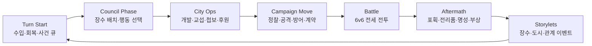

# Renaissance Conquest System Design v0

작성일: 2026-06-21

목적: 전국란스식 장수 운영 정복 RPG의 재미를 르네상스 도시국가 판타지로 재구성한다. 핵심은 전투 수식 복제가 아니라, 장수/도시/전투/이벤트가 서로 조건과 보상을 주고받는 시스템을 먼저 확정하는 것이다.

## 1. 한 줄 정의

르네상스 이탈리아의 도시국가를 배경으로, 용병대장/귀족/성직자/공학자/첩보원 장수들을 전투와 내정에 배치해 세력을 확장하고, 장수 개인 이벤트와 도시 정치 사건을 통해 로스터를 성장시키는 턴제 정복 RPG.

## 2. 설계 원칙

1. 장수는 카드가 아니라 사람이어야 한다.
   - 장수는 전투 유닛, 내정 담당자, 이벤트 주체, 관계 노드, 세력 리스크를 동시에 가진다.
   - 강한 장수라도 계약 조건, 야망, 가문 관계, 신앙/도시 이해관계 때문에 운영 비용이 생긴다.

2. 도시는 단순 생산지가 아니라 정치판이어야 한다.
   - 도시마다 부, 치안, 민심, 신앙, 문화, 요새, 길드/귀족/교회 영향력이 있다.
   - 어떤 장수를 어디에 배치했는지가 도시 사건과 장수 이벤트를 만든다.

3. 전투는 짧지만 결과가 길게 남아야 한다.
   - 6 vs 6 전열/후열 전투를 기본으로 한다.
   - 포획, 부상, 명성, 전리품, 도시 민심, 가문 관계가 전투 후 이벤트에 연결된다.

4. VN 이벤트는 부가 요소가 아니라 핵심 엔진이다.
   - 이벤트는 대사 묶음이 아니라 조건, 선택지, 효과, 플래그를 가진 storylet이다.
   - 장수 개인 루트, 도시 사건, 관계 이벤트, 전투 후 반응은 모두 같은 이벤트 스키마로 처리한다.

5. AI는 양산하고, 시스템은 검증한다.
   - AI는 장수 원형, 이벤트 초안, 도시 사건, 관계 대사, 전투 반응을 대량 생성한다.
   - 스키마, 트리거, 보상, 밸런스 곡선은 사람이 설계하고 도구로 검증한다.

## 2.1 확정된 방향

| 질문 | 결정 | 이유 |
| --- | --- | --- |
| 플레이어 정체성 | 이세계에 떨어진 특정 주인공 | 장수 이벤트/VN 대화의 감정 밀도를 만들기 위해 플레이어 얼굴이 필요하다. |
| 역사 인물 | 실명 또는 실명 변형을 쓰되, 변형 세계선 인물로 처리 | 르네상스 인지도는 살리고, 사건/성격/관계/결말은 자유롭게 설계한다. |
| 성인 요소 | 기본 게임은 비성인. 관계/욕망/정치 드라마는 유지하고 노골 묘사는 핵심 시스템에서 제외 | 전국란스식 재미의 핵심은 H가 아니라 장수 이벤트와 정복 루프다. 유저 풀과 공유 가능성을 우선한다. |
| 런타임 | Godot-first + harness 데이터/검증 계약 | 기존 idlez AFK 계약에 억지로 맞추지 않고, 전략/VN/도시/전투 데이터는 harness에서 생성·검증한다. |

주인공은 플레이어가 이름을 바꿀 수 있지만, 시스템상으로는 `protagonist` 엔티티를 가진다. 주인공은 장수처럼 전투에 직접 나설 수도 있지만, 핵심 역할은 후원자, 지휘관, 이방인 해석자, 장수 이벤트의 대화 상대다.

콘텐츠 수위 정책은 `mature political drama`로 잡는다. 암살, 배신, 포로, 몸값, 로맨스, 권력 거래는 허용하지만, 노골적인 H는 기본 루프/보상/성장 조건이 되지 않는다. 필요하면 나중에 별도 플래그 또는 외부 모드로 분리한다.

## 3. 핵심 루프



플레이 감정은 다음 순서로 돈다.

| 단계 | 플레이어 질문 | 시스템 답 |
| --- | --- | --- |
| 턴 시작 | 이번 턴에 어디가 터졌지? | 도시 사건, 장수 요청, 적군 움직임 |
| 배치 | 누구를 전장에 보내고 누구를 궁정에 남길까? | 장수의 전투/내정/충성/피로 trade-off |
| 행동 | 개발, 교섭, 첩보, 전쟁 중 무엇을 할까? | 행동권(AP) 압박 |
| 전투 | 이 전투에서 전멸보다 중요한 목표는? | 전세, 포획, 성벽, 장수 생존 |
| 후처리 | 얻은 장수/포로/명성을 어떻게 쓸까? | 계약, 몸값, 설득, 배신 리스크 |
| 이벤트 | 이 인물이 왜 중요한가? | 개인 루트와 관계 변화 |

## 4. 주요 자원

| 자원 | 역할 | 주요 획득 | 주요 소모 |
| --- | --- | --- | --- |
| AP | 턴당 전략 행동 제한 | 턴 시작, 정책, 참모 | 공격, 개발, 교섭, 첩보, 후원 |
| Ducats | 기본 금전 | 도시 수입, 무역, 몸값 | 용병 급여, 건설, 포병, 뇌물 |
| Grain | 보급 | 농촌 도시, 교역, 약탈 | 원정, 공성 유지, 기근 대응 |
| Prestige | 명성/정통성 | 승전, 후원, 외교 | 장수 영입, 조약, 반란 억제 |
| Faith | 교회 영향/신앙 자본 | 성직자 배치, 교회 후원 | 교황청 요청, 이단 재판, 사기 버프 |
| Intel | 첩보 정보 | 정찰, 첩보원, 포로 심문 | 암살, 역공작, 전투 정보 공개 |
| Tech | 르네상스 기술 | 학자/공학자 후원 | 공성기, 총병, 인쇄, 도시 시설 |
| Favor | 후원자/가문 호의 | 이벤트 선택, 선물, 조약 | 특수 장수, 긴급 자금, 정치 보호 |

## 5. 장수 시스템

장수는 `전투 스탯`, `내정 스탯`, `관계/심리`, `계약`, `story flags`를 가진다.

### 5.1 전투 스탯

| 스탯 | 의미 |
| --- | --- |
| atk | 물리/병력 기반 피해 |
| def | 물리 피해 감소, 전열 유지 |
| int | 계략, 마법이 아닌 전술/전문성, 일부 기술 피해 |
| spd | 행동 순서, 준비 스킬 차단 |
| command | 병력 효율, 사기, 대규모 전투 보정 |
| moves | 전투 중 행동 가능 횟수 |

### 5.2 내정 스탯

| 스탯 | 의미 | 대표 행동 |
| --- | --- | --- |
| commerce | 재정, 무역, 길드 | Tax Reform, Trade Deal |
| diplomacy | 외교, 포로 교섭, 조약 | Negotiate, Ransom, Alliance |
| engineering | 건설, 공성, 포병, 요새 | Fortify, Build, Siege Prep |
| intrigue | 첩보, 암살, 선동, 역공작 | Spy, Sabotage, Counterplot |
| culture | 명성, 예술 후원, 민심 | Patronage, Festival |
| faith | 교회, 이단, 사기, 종교 외교 | Blessing, Inquisition, Concordat |

### 5.3 성격/운영 값

| 값 | 의미 |
| --- | --- |
| loyalty | 현재 세력에 대한 충성. 낮으면 이탈/배신 이벤트 조건 |
| ambition | 개인 야망. 높으면 성장을 빠르게 요구하고 독자 행동 위험 |
| fatigue | 전투/내정 연속 배치 피로. 높으면 실수/부상/불만 |
| reputation | 장수 개인 평판. 등용/외교/도시 반응에 영향 |
| bond | 주인공/세력 핵심 인물과의 관계 진행도 |
| flaw | 개인 결핍. 이벤트 체인 주제 |
| desire | 원하는 보상. 돈, 복수, 명예, 신앙, 지식, 가문 회복 등 |

### 5.4 장수 등급별 이벤트 밀도

| 등급 | 수량 목표 | 이벤트 밀도 | 용도 |
| --- | ---: | --- | --- |
| S | 10-15 | 개인 체인 6-8개, 관계 이벤트 다수 | 루트급 핵심 인물 |
| A | 30-50 | 개인 체인 3-5개 | 주요 영입/세력 장수 |
| B | 80+ | 짧은 storylet 1-2개 + 범용 반응 | 로스터 폭과 포획 재미 |
| Generic | 무제한 | 시스템 반응만 | 병력/포로/계약 풀 |

## 6. 계약과 등용

르네상스 차별화의 중심은 장수를 영구 소유물로 보지 않는 것이다.

| 계약 | 설명 | 장점 | 리스크 |
| --- | --- | --- | --- |
| loyalist | 가문/세력 핵심 장수 | 급여 낮음, 배신 낮음 | 정치 이벤트에 묶임 |
| mercenary | 용병 계약 | 빠른 고용, 강한 전투력 | 급여 높음, 계약 만료 |
| hostage | 포로/인질 출신 | 적 가문 협상 카드 | 충성 낮음, 탈출 이벤트 |
| patronage | 후원 계약 | 문화/기술 이벤트 강함 | 후원 비용, 경쟁 후원자 |
| church_oath | 교회 서약 | 신앙/민심 안정 | 이단/교황청 조건 |
| marriage_tie | 결혼/가문 동맹 | 외교 안정, 명분 | 가문 분쟁 리스크 |

포획 후 선택지는 다음으로 통일한다.

```text
Capture -> Prison -> Interrogate / Ransom / Recruit / Exchange / Release / Execute
```

선택지별 기대 효과:

| 선택 | 효과 | 부작용 |
| --- | --- | --- |
| Interrogate | Intel, 도시/장수 정보 | 포로 loyalty 감소, 악명 증가 |
| Ransom | Ducats, 적 가문 관계 변화 | 장수 획득 포기 |
| Recruit | 장수 영입 | 계약/충성 관리 필요 |
| Exchange | 아군 포로 회수, 조약 | 단기 이득 낮음 |
| Release | Prestige/Favor, 외교 개선 | 즉시 전력 손실 |
| Execute | 공포/치안 단기 보정 | Prestige 하락, 복수 이벤트 |

## 7. 도시 시스템

도시는 전투 맵 노드, 생산지, 정치 이벤트 발생기, 장수 배치 슬롯을 겸한다.

| 값 | 의미 | 낮을 때/높을 때 |
| --- | --- | --- |
| wealth | 수입 기반 | 낮으면 유지비 압박, 높으면 약탈 표적 |
| security | 치안/방첩 | 낮으면 암살/반란, 높으면 첩보 방어 |
| unrest | 민심 불안 | 높으면 수입 감소, 폭동 |
| faith | 교회 영향 | 낮으면 이단/교황청 압박, 높으면 성직자 이벤트 |
| culture | 예술/학문/명성 | 인재 등장, 후원 이벤트 |
| fortification | 성벽/요새 | 방어전 보정, 공성전 길이 |
| guild_power | 상인/장인 영향 | 무역/재정 이벤트 |
| noble_power | 귀족 영향 | 가문 동맹/반발 |
| church_power | 교회 권력 | 신앙/교황청/이단 이벤트 |

### 7.1 도시 시설

| 시설 | 기능 | 배치 장수 |
| --- | --- | --- |
| Council Hall | AP, 정책, 도시 명령 | diplomacy/culture |
| Guild Exchange | 금전/무역/후원 | commerce |
| Barracks | 병력 회복, 보병 고용 | command/def |
| Arsenal | 총병/포병/장비 | engineering |
| Spy Office | Intel, 공작, 방첩 | intrigue |
| Cathedral | Faith, 민심, 사기 | faith |
| Academy | Tech, 학자 이벤트 | int/culture |
| Prison | 포로 관리, 심문, 교환 | diplomacy/intrigue |
| Workshop | 공성기, 도시 개발 | engineering |
| Theater | 명성, 관계 이벤트 | culture |

## 8. 병종과 전투 역할

| 병종 | 역할 | 강점 | 약점 |
| --- | --- | --- | --- |
| Pike Guard | 전열 방어, 기병 저지 | guard, anti-cavalry | 느림, 화약 취약 |
| Swordsmen | 균형 전열 | 안정 딜/탱 | 특화 부족 |
| Crossbowmen | 후열 물리 딜 | 방어 관통 일부 | 전열 압박에 약함 |
| Cavalry | 돌파, 후열 압박 | 빠름, 추격 | 장창/지형에 약함 |
| Arquebusiers | 고화력 사격 | 방어 높은 적 처리 | 재장전, 비쌈 |
| Artillery | 공성/광역 | 성벽/집단 피해 | 매우 느림, 보호 필요 |
| Engineers | 성벽/함정/보정 | siege prep, repair | 직접 전투 약함 |
| Spies | 암살/차단/정보 | 준비 스킬 차단 | 실패 리스크 |
| Clergy | 사기/회복/신앙 | morale, cleanse | 화력 낮음 |
| Scholars | 기술/계략 지원 | tech skill, buffs | 물리 취약 |

## 9. 전투 v0

### 9.1 보드

```text
Ally:  BACK | FRONT      Enemy: FRONT | BACK
       top  | top               top  | top
       mid  | mid               mid  | mid
       bot  | bot               bot  | bot
```

기본 규칙:

- 장수 1명은 병력 묶음 1개를 지휘한다.
- 병력 수는 HP이자 피해 기반이다.
- 전열 병종은 주로 상대 전열을 공격한다.
- 후열 병종은 전열 보호가 있을 때 안정적으로 행동한다.
- `advantage`가 전투의 판정값이다. 전멸하지 않아도 제한 턴 종료 시 전세로 승패를 낸다.

### 9.2 전세 Advantage

전세는 다음으로 움직인다.

| 변화 | 전세 |
| --- | ---: |
| 피해 우위 | 누적 피해 비율 기반 |
| 적 장수 부대 격파 | +8 |
| 아군 장수 부대 격파 | -8 |
| 성벽/도시 방어 | 방어측 시작 +10~30 |
| 정찰 성공 | 공격측 시작 +3~12 |
| 공성 준비 | 공격측 시작 +5~20 |
| 사기 스킬 | 즉시 +/-5~15 |
| 핵심 장수 부상/포획 | 큰 변동 |

전투 종료:

- 제한 턴 종료 시 advantage > 0 이면 공격측 승리.
- advantage < 0 이면 방어측 승리.
- advantage = 0 이면 방어측 승리.
- 핵심 목표 전투는 별도 승리 조건을 둘 수 있다.

### 9.3 피해 v0

전국란스의 병력 효율 감소 감각을 유지한다.

```text
effective_troops =
  troops <= 500: troops
  troops <= 2000: troops * 0.5 + 250
  otherwise: troops * 0.25 + 750

attack_power = troop_class.base_atk + atk * 10 + command * 3
defense_power = target_class.base_def + def * 8
raw_damage = effective_troops * max(10, attack_power - defense_power) / 100
final_damage = raw_damage * skill_modifier * terrain_modifier * morale_modifier
```

v0에서는 수식보다 성격이 중요하다.

- 병력이 늘면 강해지지만 선형으로 폭증하지 않는다.
- 병종 기본값이 강하게 작동한다.
- 장수 스탯은 병종 역할을 증폭한다.
- 전장 보정은 양쪽 피해량을 동시에 밀고 당긴다.

## 10. VN 이벤트 엔진

모든 이벤트는 storylet으로 본다.

```text
Trigger -> Candidate Pool -> Priority -> Choice -> Effects -> Flags -> Follow-up
```

### 10.1 이벤트 타입

| 타입 | 용도 |
| --- | --- |
| first_meeting | 첫 조우, 캐릭터 각인 |
| recruitment | 등용/계약/포획 후 설득 |
| after_battle | 승리/패배/부상/포획 반응 |
| city_assignment | 특정 도시/시설 배치 이벤트 |
| personal_chain | 장수 개인 퀘스트 |
| relationship | 장수 간 충돌/우정/라이벌 |
| political | 길드/귀족/교회/교황청 사건 |
| betrayal | 충성/야망/급여 조건 이탈 |
| patronage | 예술가/학자/공학자 후원 |
| route | 세력/엔딩/대형 분기 |

### 10.2 이벤트 보상 원칙

이벤트는 반드시 최소 하나의 시스템 효과를 가져야 한다.

좋은 효과:

- loyalty/bond 변화
- trait 추가/제거
- skill 해금
- city stat 변화
- faction relation 변화
- contract 변경
- resource gain/loss
- event flag 추가
- battle modifier 해금
- follow-up event unlock

나쁜 효과:

- 아무 변화 없는 대사
- 조건 없이 주는 큰 보상
- 이후 이벤트에 연결되지 않는 일회성 플래그
- 모든 장수에게 붙여도 차이가 없는 범용 대사

## 11. AI 콘텐츠 생성 전략

### 11.1 사람이 먼저 고정할 것

- 장수 데이터 스키마
- 도시 데이터 스키마
- 이벤트 트리거/효과 어휘
- 병종 역할과 전투 수식
- S급 장수 10-15명의 핵심 결핍/욕망/루트
- 톤 가이드와 금지 소재

### 11.2 AI가 양산할 것

- A/B급 장수 원형
- 장수별 개인 이벤트 체인 초안
- 도시별 정치 사건
- 전투 후 반응 storylet
- 포로 설득/몸값/교환 이벤트
- 장수 간 관계 이벤트
- 후원자/학자/예술가 의뢰

### 11.3 검증 규칙

- 이벤트의 trigger가 존재하는 필드만 참조하는가?
- effects가 허용된 어휘만 쓰는가?
- personal_chain은 끝나는 flag와 보상이 있는가?
- S/A급 장수는 최소 이벤트 개수를 만족하는가?
- betrayal 이벤트는 회피/복구 선택지를 제공하는가?
- 도시 사건은 최소 하나의 도시 stat에 영향을 주는가?

## 12. MVP 범위

첫 검증 목표는 전국란스 규모가 아니라, 핵심 재미가 도는지 확인하는 것이다.

| 범위 | 목표 |
| --- | ---: |
| 도시 | 5개 |
| 세력 | 4개 |
| 장수 | 30명 |
| 병종 | 8개 |
| 전투 | 6 vs 6, advantage 판정 |
| 시설 | 8개 |
| 이벤트 | 100개 |
| 개인 체인 | S급 3명, A급 5명 |
| 포획/계약 | 포획, 몸값, 등용, 계약 만료 |

MVP 도시 후보:

| 도시 | 역할 |
| --- | --- |
| Florence | 시작 도시, 문화/상업 |
| Pisa | 항구/무역/해상 갈등 |
| Siena | 귀족/교회/내정 압박 |
| Bologna | 학문/기술/용병 시장 |
| Lucca | 작은 도시, 외교/방어 튜토리얼 |

MVP 세력 후보:

| 세력 | 역할 |
| --- | --- |
| Player House | 신흥 후원자 가문 |
| Medici Court | 상업/문화 강자 |
| Papal Envoys | 신앙/정통성 압박 |
| Condottieri League | 용병/계약/배신 리스크 |

## 13. 다음 구현 순서

1. `city-command-battle-v0.md`로 도시 커맨드와 6v6 전투 흐름을 먼저 고정한다.
2. `city-command-battle-contracts-v0.yaml`로 AP 명령, 전투 액션, 후처리를 데이터화한다.
3. Godot strategy shell에서 Florence 기준 8개 도시 커맨드를 표시하고 결과를 적용한다.
4. Pike/Sword/Crossbow/Cavalry 4병종으로 첫 6v6 전투 smoke를 만든다.
5. Aftermath에서 포획 1명, 부상 1명, 이벤트 후보 1개를 생성한다.
6. 그 뒤 S급 장수 3명의 개인 storylet 체인을 확장한다.

## 14. 결정 및 남은 질문

확정:

- 플레이어는 이세계에 떨어진 특정 주인공이다.
- 역사 인물은 실명 또는 실명 변형을 쓰되, 모두 변형 세계선 인물로 처리한다.
- 기본 게임은 비성인으로 잡고, 노골적인 H는 핵심 루프에서 제외한다.
- 런타임은 Godot-first 별도 전략 RPG 계약으로 가되, harness에 데이터 생성/검증 파이프라인을 둔다.

아직 열어둘 질문:

- 자동전투와 수동전투의 비율은 어느 정도인가?
- 포획/처형 같은 선택의 톤을 얼마나 어둡게 둘 것인가?
- 주인공이 전투 유닛으로도 나서는가, 아니면 지휘/후원/선택지만 담당하는가?
- 역사 실명 사용 시 어느 정도까지 이름을 보존하고 어느 정도부터 변형할 것인가?
