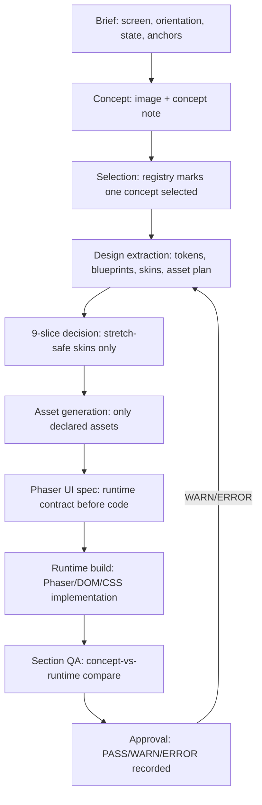

# UI Decision Standard

This document defines the portable version of our current UI decision system.
The central idea is simple: do not implement a pretty screenshot directly.
First turn it into semantic, asset, data, and runtime contracts.

## Core Pipeline



## Source Of Truth

Each file owns one kind of decision. Do not duplicate ownership.

| File | Owns | Does Not Own |
| --- | --- | --- |
| `ui-system-inventory.yaml` | existing UI/design docs audit, missing foundation docs, integration targets | per-screen layout |
| `button-system.yaml` | shared button roles, variants, anatomy, states, sizes, content rules | one-off screen copy |
| `modal-system.yaml` | shared modal host, shell, sections, actions, z-order, backdrop rules | product-specific modal content |
| `color-tokens.yaml` | semantic colors, interaction colors, contrast rules, runtime mappings | component anatomy |
| `design-registry.yaml` | concept statuses, selected sources | layout details |
| `concepts/<id>.md` | intent, art anchor, composition rules | final text or data |
| `art-direction.yaml` | identity, palette, materials, art constraints | component geometry |
| `layout-tokens.yaml` | spacing, region ratios, safe areas, breakpoints | asset file paths |
| `component-blueprints.yaml` | semantic sections, component anatomy, slots, box model, data binding, text rules | generated file status |
| `component-skins.yaml` | which visual skin belongs to which component/state | source generation prompts |
| `asset-plan.yaml` | asset keys, generation mode, paths, prompt notes, platform usage, status | component ownership rationale |
| `motion-juice.yaml` | motion/reward feedback rules | balance numbers |
| `critique-rubric.yaml` | blockers and approval criteria | runtime implementation |
| `runtime/specs/ui/<surface>.yaml` | Phaser implementation contract, data contract, visual QA plan | new component anatomy |

## Installation Foundation Audit

Before the first screen is built in a new project, inspect the project for
existing UI system documents. Look for button, modal, color, typography,
spacing, icon, design-system, 9-slice, Phaser harness, or UI harness docs.

Record the result in `ui-system-inventory.yaml`.

- If a system exists, connect it to this standard and preserve its local naming.
- If a system is partial, add only the missing contract fields.
- If a system is absent, create the minimum shared document from the templates.
- Do not start a new screen by inventing local button or modal styles.

Minimum foundation files:

```text
design/<game>/ui-system-inventory.yaml
design/<game>/button-system.yaml
design/<game>/modal-system.yaml
design/<game>/color-tokens.yaml
```

Typography, spacing, and icon systems may live in existing project docs,
`layout-tokens.yaml`, `art-direction.yaml`, or additional local documents.
The inventory must say where they live.

## Non-Negotiable Rules

1. A concept cannot jump directly to runtime.
   It must pass through design extraction and a runtime spec.

2. Shared UI foundations come before screen-local invention.
   Buttons, modals, colors, typography, spacing, icons, and 9-slice rules must
   be discovered or created before implementing a new screen.

3. Name UI by player/runtime meaning, not by crop shape.
   Use `TopResourceLedger`, `SkillChoiceCard`, or `ModalFooter`, not
   `gold_box`, `left_png`, or `pretty_panel`.

4. Split large screens into semantic sections before components.
   Examples: `top_hud`, `combat_playfield`, `bottom_dock`,
   `modal_header`, `modal_body`, `modal_footer`.

5. Every section owns a coherent workflow.
   A bottom nav can open a shop modal, but it does not own the product grid.

6. Every repeated or touchable component needs a box model.
   Declare min/default size, content insets, padding, gaps, responsive behavior,
   text clamp rules, touch target rules, and states that must not resize layout.

7. Text, numbers, prices, timers, labels, counters, cooldowns, and localized copy
   remain runtime-native unless explicitly marked decorative.

8. A generated asset must be referenced by key.
   Runtime code should not invent ad hoc asset names that bypass `asset-plan.yaml`.

9. Visual QA is section-based.
   Compare the same semantic crop from the selected concept and runtime
   screenshot before judging the full screen.

10. A runtime implementation must preserve section boundaries.
   Do not collapse top/body/bottom, modal header/body/footer, or combat/HUD
   ownership into one undifferentiated block.

11. Approval requires evidence.
    Record PASS/WARN/ERROR, screenshot or compare-board paths, and the next edit
    scope when the result is not approved.

## Shared Button Rules

Every project should have one button system before screen work expands.
At minimum it must define:

- button roles: primary, secondary, destructive, icon, tab, chip, dock, CTA;
- anatomy: skin, icon slot, label slot, badge/counter slot, hit target;
- variants and states: normal, hover/focus, pressed, selected, disabled, loading;
- minimum touch size and stable dimensions;
- text clamp and localization overflow rules;
- which variants use generated skins, native primitives, or Phaser 9-slice;
- which asset keys back each generated skin or icon;
- runtime token mapping for CSS classes, Phaser constants, and scene helpers.

Reusable button skins must not bake labels, prices, counters, cooldowns, or
localized text. If a button has an ornate frame, stretch-safe material belongs
in the 9-slice skin and non-stretch-safe ornaments belong in an ornament layer.

## Shared Modal Rules

Every project should have one modal/dialog system before modal screens multiply.
At minimum it must define:

- modal host and stacking policy;
- shell anatomy: backdrop, frame, header, body, footer, close affordance;
- semantic section ownership: header/body/footer must remain separable;
- size policies for compact mobile, target mobile, and wider screens;
- action placement and button variants;
- scroll ownership;
- focus, escape/back, outside-click, and pointer-capture behavior;
- 9-slice frame rules and ornament layers;
- data contract rules for modal content.

Modal content may vary by feature, but the shell, action row, backdrop, z-order,
and close behavior should be shared.

## Shared Color Rules

Every project should have semantic color tokens before implementation. Avoid
hardcoding visual colors directly in screen code.

Minimum semantic groups:

- surface/background;
- text primary/secondary/muted/inverse;
- border/divider;
- action primary/secondary/destructive/disabled;
- status success/warning/danger/info;
- rarity or reward tiers when the game needs them;
- overlay/backdrop/scrim;
- focus/selection/pressed states.

Runtime code should refer to semantic tokens or mapped CSS variables/Phaser
constants, not one-off hex values.

## Assetization Modes

Use these exact modes in `asset-plan.yaml` and component files:

| Mode | Meaning | Examples |
| --- | --- | --- |
| `generate_image` | Needs new bitmap output | portraits, icons, textured panels, ornate buttons |
| `native_ui` | Better built with runtime primitives | text, simple panels, progress bars, grids |
| `hybrid` | Native layout plus generated skins/icons | cards, modals, buttons, HUD strips |
| `reuse` | Existing approved asset | shared icon, previous panel skin, existing portrait |

## 9-Slice Policy

Use Phaser 9-slice only when all are true:

- The asset is a rectangular UI skin: panel, card, modal frame, button, dock,
  tab, chip, toast, slot frame, or progress frame.
- It must render at multiple sizes or aspect ratios.
- It contains no baked text, numbers, prices, badges, timers, or icons.
- The center can stretch without smearing important illustration.
- `slice_hints` are valid: `left + right < width` and `top + bottom < height`.
- `content_insets` are declared separately from `slice_hints`.

Do not use 9-slice for characters, monsters, buildings, icons, portraits,
backgrounds, VFX, maps, hex tiles, sprite sheets, or non-rectangular art.

Non-stretch-safe crests, corner leaves, vines, clasps, gems, and badges become
fixed transparent ornament sprites. They sit above the base skin and below
readable content.

## Phaser Runtime Routing

| Surface Type | Preferred Mode |
| --- | --- |
| Text-heavy modal/list/form | `dom_overlay` |
| Combat, board, particles, sprite-heavy visuals | `phaser_canvas` |
| Combat canvas with native HUD/modals | `hybrid` |
| Rectangular generated UI skin | Phaser WebGL `scene.add.nineslice(...)` |
| Simple solid box, separator, cooldown ring | Phaser graphics or CSS primitive |
| Fixed icon/portrait/badge | Image/sprite |

## Data Contract Rules

Every Phaser UI spec must declare where user-facing data comes from:

- content JSON/YAML
- scenario or fixture JSON
- runtime state/global
- route/query parameter
- temporary hardcoding allowlist for known legacy debt

Do not put content tables, reward lists, item IDs, skill pools, shop products,
or balance numbers directly into runtime JS/HTML/CSS.

## Approval Gate

A surface can move to `approved` only when:

- a selected concept exists;
- foundation systems are discovered or created for buttons, modals, colors, and
  related UI basics;
- design-system files are extracted;
- every large surface has semantic sections;
- every repeated component has anatomy, states, slots, and box model;
- generated assets are declared in `asset-plan.yaml`;
- rectangular skins separate `slice_hints` from `content_insets`;
- runtime spec lists source concepts, blueprints, assets, data contract, and QA;
- smoke/audit checks pass or known gaps are documented;
- section-level visual comparison is PASS, or WARN with a concrete follow-up.

## Common Rejection Reasons

- Full-screen mock PNG used as implementation.
- Component named by bitmap crop instead of gameplay meaning.
- UI hides the combat/playfield.
- Mobile text overflows or changes component size unpredictably.
- Runtime hardcodes product/reward/skill lists.
- CSS background is used as production 9-slice when Phaser skin is required.
- Ornaments from the concept disappear without explicit rejection.
- A section is tuned against the wrong or rejected concept.
